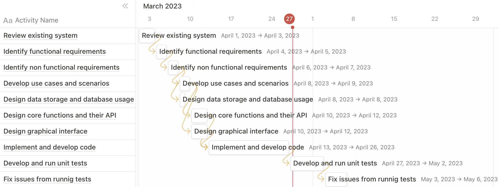

# Project Estimation - CURRENT

Date: 21/04/2023

Version: 1.0

# Estimation approach

Consider the EZWallet project in CURRENT version (as received by the teachers), assume that you are going to develop the project INDEPENDENT of the deadlines of the course

# Estimate by size

###

|                                                                                                        | Estimate                                        |
| ------------------------------------------------------------------------------------------------------ | ----------------------------------------------- |
| NC (Estimated number of classes to be developed)                                                       | 1 classes for database connection               |
|                                                                                                        | 3 classes for database models                   |
|                                                                                                        | 1 classes for api routes                        |
|                                                                                                        | 1 classes for application context               |
|                                                                                                        | 4 classes for application authentication        |
|                                                                                                        | 6 classes for application controller            |
|                                                                                                        | 2 classes for appplication users                |
|                                                                                                        | 9 classes for tests                             |
|                                                                                                        | 10 classes for GUI                              |
| Total NC                                                                                               | 37                                              |
| A (Estimated average size per class)                                                                   | 30 LOC per class                                |
| S (Estimated size of project)                                                                          | NC _ A = 37 _ 30 = 1110 LOC                     |
| E (Estimated effort, in person hours, here use productivity 10 LOC per person hour)                    | S / P = 1110 / 10 = 111 person hour             |
| C (Estimated cost, in euro (here use 1 person hour cost = 30 euro))                                    | E _ C = 111 _ 30 = 3330 euro                    |
| Estimated calendar time, in calendar weeks (Assume team of 4 people, 8 hours per day, 5 days per week) | E / (T _ H _ D) = 111 / (4 _ 8 _ 5) = 0,7 weeks |

# Estimate by product decomposition

###

| Component name        | Estimated effort  |
| --------------------- | ----------------- |
| Requirement document  | 12 person hour    |
| GUI prototype         | 22 person hour    |
| Design document       | 14 person hour    |
| Code                  | 53 person hour    |
| Unit tests            | 13 person hour    |
| Api tests             | 13 person hour    |
| Management documents  | 11 person hour    |
| --------------------- | ----------------- |
| Total                 | 138 person hour   |

# Estimate by activity decomposition

###

| Activity name                          | Estimated effort (person hours) |
| -------------------------------------- | ------------------------------- |
| Review existing systems                | 8                               |
| Identify functional requirements       | 4                               |
| Identify non functional requirements   | 2                               |
| Develop use cases and scenarios        | 8                               |
| Estimate and plannig activities        | 7                               |
| Design data storage and database usage | 5                               |
| Design graphical interface             | 11                              |
| Design core functions and their API    | 14                              |
| Implement and develop code             | 53                              |
| Develop and run unit tests             | 23                              |
| Verification and validation            | 10                              |
| ---------------------                  | -----------------               |
| Total                                  | 145 person hour                 |

###

Insert here Gantt chart with above activities

# Summary

Report here the results of the three estimation approaches. The estimates may differ. Discuss here the possible reasons for the difference

|                                    | Estimated effort | Estimated duration |
| ---------------------------------- | ---------------- | ------------------ |
| estimate by size                   | 111 person hour  | 27,75 hour         |
| estimate by product decomposition  | 138 person hour  | 34,5 hour          |
| estimate by activity decomposition | 145 person hour  | 36,25 hour         |

The estimated effort and the estimated duration of the three different approaches are similar. The estimation by size is more different than the others probably because there are more given data, instead the estimation by activities and by products decomposition is more abstract so more difficult to concretalize in person hours and we probably sovrastimate it.
