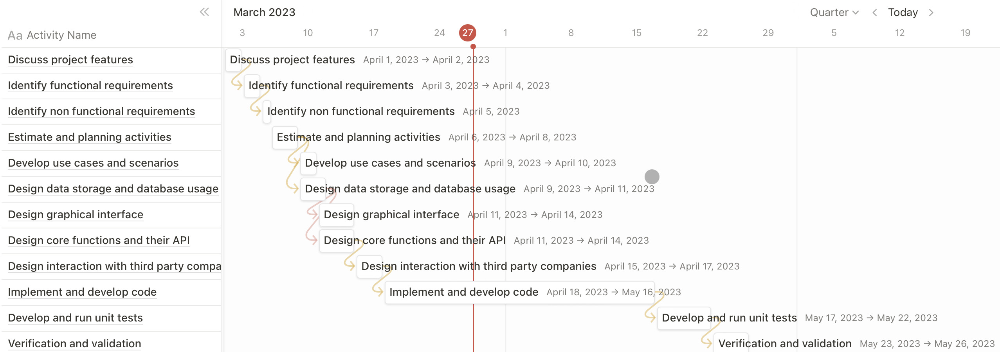

# Project Estimation - FUTURE

Date: 20/04/2023

Version: 1.0

# Estimation approach

Consider the EZWallet project in FUTURE version (as proposed by the team), assume that you are going to develop the project INDEPENDENT of the deadlines of the course

# Estimate by size

###

The base component are refered to the V1 functionalities, instead the extended ones are refered to the new features added

|                                                                                                        | Estimate                                             |
| ------------------------------------------------------------------------------------------------------ | ---------------------------------------------------- |
| NC (Estimated number of classes to be developed)                                                       | 1 classes for database connection                    |
|                                                                                                        | 3 classes for base database models                   |
|                                                                                                        | 6 classes for extended database models               |
|                                                                                                        | 2 classes for api routes                             |
|                                                                                                        | 1 classes for application context                    |
|                                                                                                        | 4 classes for application authentication             |
|                                                                                                        | 6 classes for base application controller            |
|                                                                                                        | 10 classes for extended application controller       |
|                                                                                                        | 2 classes for appplication users                     |
|                                                                                                        | 9 classes for base tests                             |
|                                                                                                        | 14 classes for extended tests                        |
|                                                                                                        | 25 classes for GUI                                   |
|                                                                                                        | 4 classes for interaction with map service           |
|                                                                                                        | 4 classes for interaction with payment company       |
|                                                                                                        | 4 classes for interaction with exchange rate tracker |
| Total NC                                                                                               | 95 classes                                           |
| A (Estimated average size per class)                                                                   | 30 LOC per class                                     |
| S (Estimated size of project)                                                                          | NC _ A = 95 _ 30 = 2850 LOC                          |
| E (Estimated effort, in person hours, here use productivity 10 LOC per person hour)                    | S / P = 1850 / 10 = 285 person hour                  |
| C (Estimated cost, in euro (here use 1 person hour cost = 30 euro))                                    | E _ C = 285 _ 30 = 8550 euro                         |
| Estimated calendar time, in calendar weeks (Assume team of 4 people, 8 hours per day, 5 days per week) | E / (T _ H _ D) = 285 / (4 _ 8 _ 5) = 1,78 weeks     |

# Estimate by product decomposition

###

| Component name        | Estimated effort  |
| --------------------- | ----------------- |
| Requirement document  | 26 person hour    |
| GUI prototype         | 44 person hour    |
| Design document       | 39 person hour    |
| Code                  | 112 person hour   |
| Unit tests            | 23 person hour    |
| Api tests             | 27 person hour    |
| Management documents  | 21 person hour    |
| --------------------- | ----------------- |
| Total                 | 292 person hour   |

# Estimate by activity decomposition

###

| Activity name                                 | Estimated effort (person hours) |
| --------------------------------------------- | ------------------------------- |
| Discuss project features                      | 13                              |
| Identify functional requirements              | 9                               |
| Identify non functional requirements          | 5                               |
| Develop use cases and scenarios               | 11                              |
| Estimate and plannig activities               | 14                              |
| Design data storage and database usage        | 17                              |
| Design graphical interface                    | 20                              |
| Design core functions and their API           | 24                              |
| Design interaction with third party companies | 25                              |
| Implement and develop code                    | 112                             |
| Develop and run unit tests                    | 32                              |
| Verification and validation                   | 21                              |
| ---------------------                         | -----------------               |
| Total                                         | 303 person hour                 |

Insert here Gantt chart with above activities

# Summary

Report here the results of the three estimation approaches. The estimates may differ. Discuss here the possible reasons for the difference

|                                    | Estimated effort | Estimated duration |
| ---------------------------------- | ---------------- | ------------------ |
| estimate by size                   | 285 person hour  | 68,75 hour         |
| estimate by product decomposition  | 292 person hour  | 73 hour            |
| estimate by activity decomposition | 303 person hour  | 75,75 hour         |

The estimations of the three approcheas are very close becuse their are thinked by the same group with the same ideas and the same bias, so the propostions in each estimations are similar.
