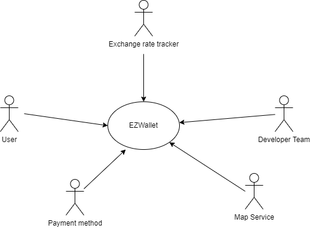
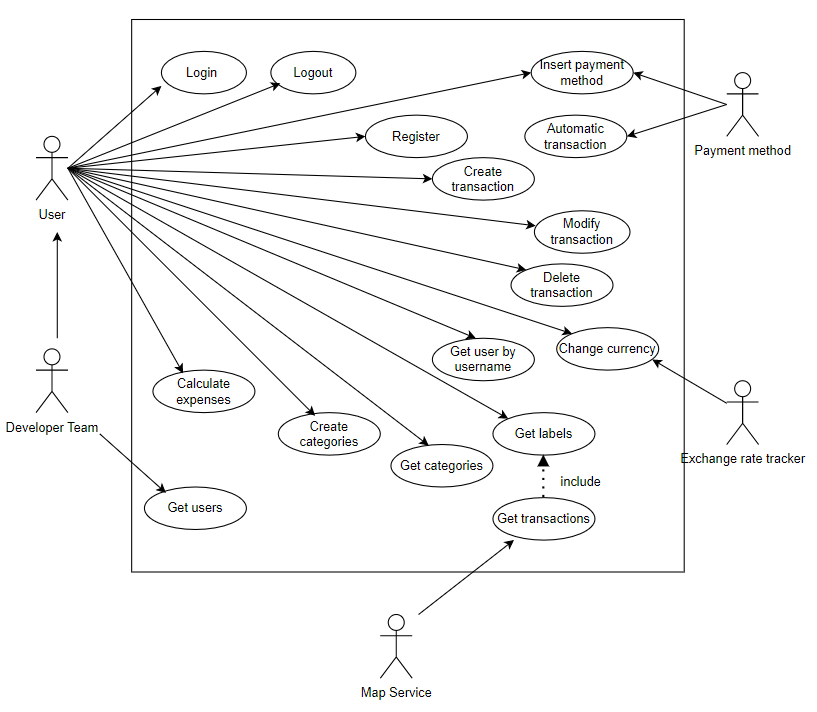
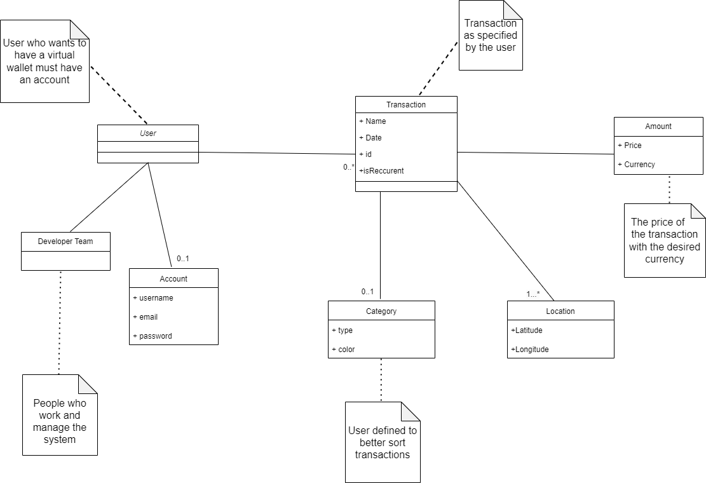
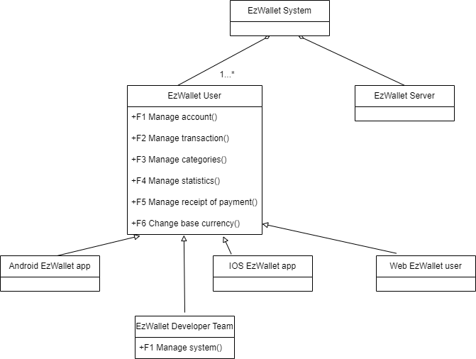
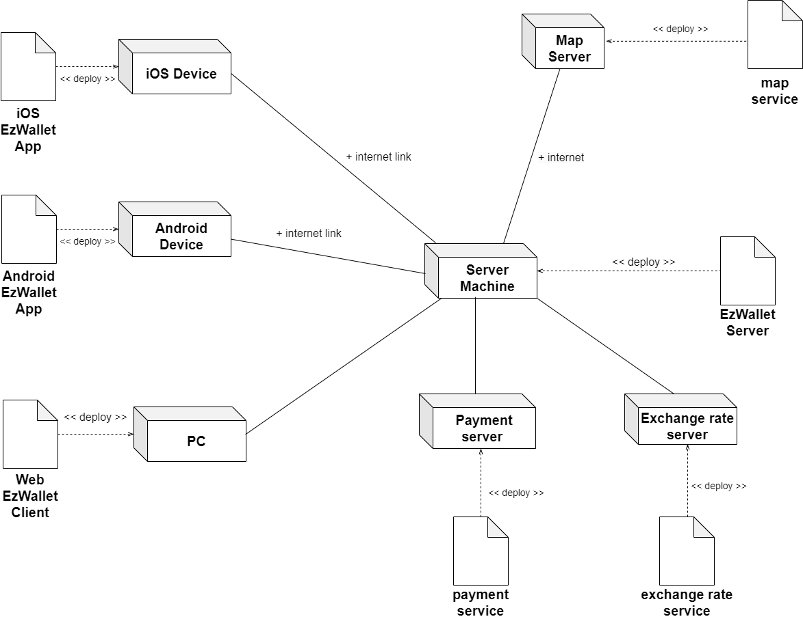

# Requirements Document - future EZWallet

Date: 26/04/2023

Version: V2 - description of EZWallet in FUTURE form (as proposed by the team)

| Version number 2 | Change |
| ---------------- | :----- |
| 1.0              |        |

# Contents

- [Requirements Document - future EZWallet](#requirements-document---future-ezwallet)
- [Contents](#contents)
- [Informal description](#informal-description)
- [Stakeholders](#stakeholders)
- [Context Diagram and interfaces](#context-diagram-and-interfaces)
  - [Context Diagram](#context-diagram)
  - [Interfaces](#interfaces)
- [Stories and personas](#stories-and-personas)
- [Functional and non functional requirements](#functional-and-non-functional-requirements)
  - [Functional Requirements](#functional-requirements)
  - [Non Functional Requirements](#non-functional-requirements)
- [Use case diagram and use cases](#use-case-diagram-and-use-cases)
  - [Use case diagram](#use-case-diagram)
    - [Use case 1, Login](#use-case-1-login)
      - [Scenario 1.1](#scenario-11)
      - [Scenario 1.2](#scenario-12)
    - [Use case 2, Register](#use-case-2-register)
      - [Scenario 2.1](#scenario-21)
      - [Scenario 2.2](#scenario-22)
    - [Use case 3, Logout](#use-case-3-logout)
      - [Scenario 3.1](#scenario-31)
    - [Use case 4, Create transaction](#use-case-4-create-transaction)
      - [Scenario 4.1](#scenario-41)
      - [Scenario 4.2](#scenario-42)
      - [Scenario 4.3](#scenario-43)
      - [Scenario 4.4](#scenario-44)
      - [Scenario 4.5](#scenario-45)
    - [Use case 5, Modify transaction](#use-case-5-modify-transaction)
      - [Scenario 5.1](#scenario-51)
      - [Scenario 5.2](#scenario-52)
    - [Use case 6, Delete transaction](#use-case-6-delete-transaction)
      - [Scenario 6.1](#scenario-61)
      - [Scenario 6.2](#scenario-62)
    - [Use case 7, Get transactions](#use-case-7-get-transactions)
      - [Scenario 7.1](#scenario-71)
    - [Use case 8, Get labels](#use-case-8-get-labels)
      - [Scenario 8.1](#scenario-81)
    - [Use case 9, Get categories](#use-case-9-get-categories)
      - [Scenario 9.1](#scenario-91)
    - [Use case 10, Create categories](#use-case-10-create-categories)
      - [Scenario 10.1](#scenario-101)
    - [Use case 11, Get user by username](#use-case-11-get-user-by-username)
      - [Scenario 11.1](#scenario-111)
      - [Scenario 11.2](#scenario-112)
    - [Use case 12, Get users](#use-case-12-get-users)
      - [Scenario 12.1](#scenario-121)
      - [Scenario 12.2](#scenario-122)
    - [Use case 13, Insert payment method](#use-case-13-insert-payment-method)
      - [Scenario 13.1](#scenario-131)
      - [Scenario 13.2](#scenario-132)
    - [Use case 14, Automatic transaction](#use-case-14-automatic-transaction)
      - [Scenario 14.1](#scenario-141)
      - [Scenario 14.2](#scenario-142)
    - [Use case 15, Change currency](#use-case-15-change-currency)
      - [Scenario 15.1](#scenario-151)
      - [Scenario 15.2](#scenario-152)
    - [Use case 16, Calculates expenses](#use-case-16-calculates-expenses)
      - [Scenario 16.1](#scenario-161)
- [Glossary](#glossary)
- [System Design](#system-design)
- [Deployment Diagram](#deployment-diagram)

# Informal description

EZWallet (read EaSy Wallet) is a software application designed to help individuals and families keep track of their expenses. Users can enter and categorize their expenses, allowing them to quickly see where their money is going. EZWallet is a powerful tool for those looking to take control of their finances and make informed decisions about their spending.

# Stakeholders

| Stakeholder name                                           |                             Description                             |
| :--------------------------------------------------------- | :-----------------------------------------------------------------: |
| User                                                       |  End-users like individuals and families that use the application   |
| Developer team                                             |              People who work and configure the system               |
| Competitor                                                 |        Other similar products that can inspire new features         |
| Google play and Apple store (legal + quality requirements) |                Gatekeepers of Android and IOS stores                |
| Map service                                                |   The service useful to attach location to a specific transaction   |
| Payment company                                            | The company who manage a payment method linked with the application |
| Exchange rate tracker                                      |  The system that provide the exchange rate of a specific currency   |

# Context Diagram and interfaces

## Context Diagram

\<Define here Context diagram using UML use case diagram>

\<actors are a subset of stakeholders>

## Interfaces

\<describe here each interface in the context diagram>

\<GUIs will be described graphically in a separate document>

| Actor                 | Phisical interface |                        Logical interface                        |
| :-------------------- | :----------------: | :-------------------------------------------------------------: |
| User                  |   PC/Smartphone    | GUI (manage transactions and categories, signup, login, logout) |
| Developer team        |         PC         |                               API                               |
| Map Service           |   Internet link    |                               API                               |
| Payment company       |   Internet Link    |                               API                               |
| Exchange rate tracker |   Internet link    |                               API                               |

# Stories and personas

\<A Persona is a realistic impersonation of an actor. Define here a few personas and describe in plain text how a persona interacts with the system>

\<Persona is-an-instance-of actor>

User 1: Young adult starting living alone and managing his money  
User 2: A father of a family that wants to analyse incomes and outcomes  
User 3: Household expenses to balance and limit it  
User 4: A group of friends organizing a trip  
User 5: Student living aborad for his studies who want to reduce expenses  
User 6: Someone that has just started his worklife and saving his first paychecks  
User 7: Reriree that wants to understand how he has spent his pension

\<stories will be formalized later as scenarios in use cases>

# Functional and non functional requirements

## Functional Requirements

\<In the form DO SOMETHING, or VERB NOUN, describe high level capabilities of the system>

\<they match to high level use cases>

| ID                                      |                                                         Description                                                          |
| :-------------------------------------- | :--------------------------------------------------------------------------------------------------------------------------: |
| FR1 Manage account                      | The system is capable of the following functions:login, register, logout, refresh token, show user and show user by username |
| FR2 Manage transactions                 |                                  The system is able to create, delete and show transactions                                  |
| FR2.1 Manage normal transactions        |                                              Manage non-recurrent transactions                                               |
| FR2.2 Manage recurrent transactions     |                                   Manage transactions adding the period of the recurrence                                    |
| FR2.3 Manage transactions with location |                                     Manage transactions adding the location of purchase                                      |
| FR3 Manage categories                   |                       The software allows to create, delete and show categories linked to transactions                       |
| FR4 Manage maps                         |                The system shows the exact position in a map of the place where the transaction has been made                 |
| FR5 Manage statistics                   |                           The software allows to handle and show statistics of user's transactions                           |
| FR5.1 Manage periodical statistics      |                              Compute total annual and monthly amount of the user's transactions                              |
| FR5.2 Manage categorical statistics     |                                Compute total amount of the user's transactions by categories                                 |
| FR6 Manage payment method tracker       |           The system can see the expenses of a connected payment method to register automatically the transactions           |
| FR7 Manage receipt of payment           |          The software allows to add, remove and show the photos of receipts of the payments linked to transactions           |
| FR8 Change base currency                |                    The system can show the amounts in different currencies with the actual exchange rate                     |
| FR9 Manage System                       |                                  The admin can check the users of the system at any moment                                   |

## Non Functional Requirements

\<Describe constraints on functional requirements>

| ID   |  Type (efficiency, reliability, ..)  |                                  Description                                   |           Refers to |
| ---- | :----------------------------------: | :----------------------------------------------------------------------------: | ------------------: |
| NFR1 |               Security               |          Basic form of authentication using access and refresh tokens          |                 FR1 |
| NFR2 |             Availability             |                           Max server downtime 1.5h/y                           |     FR1,FR2,FR3,FR4 |
| NFR4 |              Usability               |             The creation of a transaction should be easy and fast              |             FR2,FR3 |
| NFR4 | Portability of app (IOS and Android) | The app should be available and fuctioning on a large number of mobile devices |                     |
| NFR1 |              Efficiency              |                     All functions should work in 1 second                      | FR1,FR2,FR3,FR4,FR5 |

# Use case diagram and use cases

## Use case diagram

\<define here UML Use case diagram UCD summarizing all use cases, and their relationships>

\<next describe here each use case in the UCD>

### Use case 1, Login

| Actors Involved  |                          User                           |
| :--------------- | :-----------------------------------------------------: |
| Precondition     |                   User has an account                   |
| Post condition   |       User receives AccessToken and RefreshToken        |
| Nominal Scenario |   User asks to login and try to authenticate himself    |
| Exceptions       | Email does not exist, password incorrect, invalid Token |

##### Scenario 1.1

\<describe here scenarios instances of UC1>

\<a scenario is a sequence of steps that corresponds to a particular execution of one use case>

\<a scenario is a more formal description of a story>

\<only relevant scenarios should be described>

| Scenario 1.1   |                                                                                                                     |
| -------------- | :-----------------------------------------------------------------------------------------------------------------: |
| Precondition   |                                                 User has an account                                                 |
| Post condition |                                     User receives AccessToken and RefreshToken                                      |
| Step#          |                                                     Description                                                     |
| 1              |                                                 User asks to login                                                  |
| 2              |                                         The system asks email and password                                          |
| 3              |                                         The user enters email and password                                          |
| 4              |                               The system checks if email and password are not correct                               |
| 5              | If email and password are not correct, the user is not authorized and receives an error message "wrong credentials" |

##### Scenario 1.2

| Scenario 1.2   |                                                                                                                                |
| -------------- | :----------------------------------------------------------------------------------------------------------------------------: |
| Precondition   |                                                      User has an account                                                       |
| Post condition |                                                   An error message is showed                                                   |
| Step#          |                                                          Description                                                           |
| 1              |                                                       User asks to login                                                       |
| 2              |                                               The system asks email and password                                               |
| 3              |                                               The user enters email and password                                               |
| 4              |                                    The system checks if email and password are not correct                                     |
| 5              | If email and password are not correct, the user is not authorized and receives an errore message "please you need to register" |

### Use case 2, Register

| Actors Involved  |                                User                                 |
| ---------------- | :-----------------------------------------------------------------: |
| Precondition     |                         User has no account                         |
| Post condition   |                          User has account                           |
| Nominal Scenario | User provides his credentials and obtains the access to the service |
| Exceptions       |                        email already exists                         |

##### Scenario 2.1

| Scenario 2.1   |                                                                        |
| -------------- | :--------------------------------------------------------------------: |
| Precondition   |                          User has no account                           |
| Post condition |                            User has account                            |
| Step#          |                              Description                               |
| 1              |                         User asks to register                          |
| 2              | The system asks username and does not check if it is already available |
| 3              |      The system asks email and checks if it is already available       |
| 4              |                        The system asks password                        |
| 5              |                   The system asks a profile picture                    |
| 6              |       User enters username, email, password and profile picture        |
| 7              |          If the email is valid, the system stores the account          |

##### Scenario 2.2

| Scenario 2.2   |                                                                                                                              |
| -------------- | :--------------------------------------------------------------------------------------------------------------------------: |
| Precondition   |                                                     User has no account                                                      |
| Post condition |                                                   Error message is showed                                                    |
| Step#          |                                                         Description                                                          |
| 1              |                                                    User asks to register                                                     |
| 2              |                            The system asks username and does not check if it is already available                            |
| 3              |                                 The system asks email and checks if it is already available                                  |
| 4              |                                                   The system asks password                                                   |
| 5              |                                           User enters username,email and password                                            |
| 6              | If the email already exists, the registration was unsuccessful and the errore message "You are already register" is returned |

### Use case 3, Logout

| Actors Involved  |                 User                 |
| ---------------- | :----------------------------------: |
| Precondition     |           User has account           |
| Post condition   | User is disconnected from the system |
| Nominal Scenario | User completes the logout procedure  |
| Exceptions       |                                      |

##### Scenario 3.1

| Scenario 3.1   |                                          |
| -------------- | :--------------------------------------: |
| Precondition   |             User has account             |
| Post condition |   User is disconnected from the system   |
| Step#          |               Description                |
| 1              |           User asks to logout            |
| 2              | The system performs the logout procedure |

### Use case 4, Create transaction

| Actors Involved  |                             User                             |
| ---------------- | :----------------------------------------------------------: |
| Precondition     | User has account, user has been authenticated and authorized |
| Post condition   |                  The transaction is created                  |
| Nominal Scenario |   User creates new transaction by entering its information   |
| Variants         |   The user adds location or the periodicity or the receipt   |
| Exceptions       |                      User is not logged                      |

##### Scenario 4.1

| Scenario 4.1   |                                                              |
| -------------- | :----------------------------------------------------------: |
| Precondition   | User has account, user has been authenticated and authorized |
| Post condition |                  The transaction is created                  |
| Step#          |                         Description                          |
| 1              |              User asks to create a transaction               |
| 2              |        User inserts the name, the amount and the type        |
| 3              |    The transaction is created and stored in the Database     |

##### Scenario 4.2

| Scenario 4.2   |                                                              |
| -------------- | :----------------------------------------------------------: |
| Precondition   | User has account, user has been authenticated and authorized |
| Post condition |           The transaction with location is created           |
| Step#          |                         Description                          |
| 1              |              User asks to create a transaction               |
| 2              |        User inserts the name, the amount and the type        |
| 3              |         User specifies the location of the purchase          |
| 4              |    The transaction is created and stored in the Database     |

##### Scenario 4.3

| Scenario 4.3   |                                                                    |
| -------------- | :----------------------------------------------------------------: |
| Precondition   |    User has account, user has been authenticated and authorized    |
| Post condition |                The periodic transaction is created                 |
| Step#          |                            Description                             |
| 1              |                 User asks to create a transaction                  |
| 2              |           User inserts the name, the amount and the type           |
| 3              | User specifies that is a periodic transaction with its peridiocity |
| 4              |       The transaction is created and stored in the Database        |

##### Scenario 4.4

| Scenario 4.4   |                                                              |
| -------------- | :----------------------------------------------------------: |
| Precondition   | User has account, user has been authenticated and authorized |
| Post condition |           The transaction with receipt is created            |
| Step#          |                         Description                          |
| 1              |              User asks to create a transaction               |
| 2              |        User inserts the name, the amount and the type        |
| 3              |     User provide a photo of the receipt of the purchase      |
| 4              |    The transaction is created and stored in the Database     |

##### Scenario 4.5

| Scenario 4.5   |                                                                                            |
| -------------- | :----------------------------------------------------------------------------------------: |
| Precondition   |                User has account, user has been authenticated and authorized                |
| Post condition |                                 An error message is showed                                 |
| Step#          |                                        Description                                         |
| 1              |                             User asks to create a transaction                              |
| 2              |                   User tries to insert the name, the amount and the type                   |
| 3              | The transaction is not created because the user is not logged and an error message appears |

### Use case 5, Modify transaction

| Actors Involved  |                                                      User                                                       |
| ---------------- | :-------------------------------------------------------------------------------------------------------------: |
| Precondition     | User has account, user has been authenticated and authorized and the transaction with a specific ID must exists |
| Post condition   |                                           The transaction is modified                                           |
| Nominal Scenario |                    User modifies one or more information of a transaction by entering the ID                    |
| Exceptions       |                                         The transaction does not exists                                         |

##### Scenario 5.1

| Scenario 5.1   |                                                                                                                 |
| -------------- | :-------------------------------------------------------------------------------------------------------------: |
| Precondition   | User has account, user has been authenticated and authorized and the transaction with a specific ID must exists |
| Post condition |                                           The transaction is deleted                                            |
| Step#          |                                                   Description                                                   |
| 1              |               User chooses a specific transaction and change the infomation that wants to modify                |
| 2              |                  The transaction with the corresponding ID is updated and stored the Database                   |

##### Scenario 5.2

| Scenario 5.2   |                                                                                                                 |
| -------------- | :-------------------------------------------------------------------------------------------------------------: |
| Precondition   | User has account, user has been authenticated and authorized and the transaction with a specific ID must exists |
| Post condition |                          The transaction is not deleted and an error message is showed                          |
| Step#          |                                                   Description                                                   |
| 1              |               User chooses a specific transaction and change the infomations that wants to modify               |
| 2              |            The transaction with the corresponding ID doesn't exist and a error message is displayed             |

### Use case 6, Delete transaction

| Actors Involved  |                                                      User                                                       |
| ---------------- | :-------------------------------------------------------------------------------------------------------------: |
| Precondition     | User has account, user has been authenticated and authorized and the transaction with a specific ID must exists |
| Post condition   |                                           The transaction is deleted                                            |
| Nominal Scenario |                                 User deletes one transaction by entering the ID                                 |
| Exceptions       |                                         The transaction does not exists                                         |

##### Scenario 6.1

| Scenario 6.1   |                                                                                                                 |
| -------------- | :-------------------------------------------------------------------------------------------------------------: |
| Precondition   | User has account, user has been authenticated and authorized and the transaction with a specific ID must exists |
| Post condition |                                           The transaction is deleted                                            |
| Step#          |                                                   Description                                                   |
| 1              |                                       User chooses a specific transaction                                       |
| 2              |                     The transaction with the corresponding ID is deleted from the Database                      |

##### Scenario 6.2

| Scenario 6.2   |                                                                                                                 |
| -------------- | :-------------------------------------------------------------------------------------------------------------: |
| Precondition   | User has account, user has been authenticated and authorized and the transaction with a specific ID must exists |
| Post condition |                                           An error message is showed                                            |
| Step#          |                                                   Description                                                   |
| 1              |                                       User chooses a specific transaction                                       |
| 2              |          The transaction with the corresponding ID doesn't exist in the Database and a error is showed          |

### Use case 7, Get transactions

| Actors Involved  |                      User, Map service                       |
| ---------------- | :----------------------------------------------------------: |
| Precondition     | User has account, user has been authenticated and authorized |
| Post condition   |                All the transactions are shown                |
| Nominal Scenario |       User sees all the transactions that he has made        |
| Exceptions       |                                                              |

##### Scenario 7.1

| Scenario 7.1   |                                                                                                                     |
| -------------- | :-----------------------------------------------------------------------------------------------------------------: |
| Precondition   |                            User has account, user has been authenticated and authorized                             |
| Post condition |                                           All the transactions are shown                                            |
| Step#          |                                                     Description                                                     |
| 1              |                                User asks to see all the transactions on the account                                 |
| 2              | For the transactions that the location is available the system asks to retrieve the geo-location to the map service |
| 3              |                                       The map service sends the location map                                        |
| 4              |                       The system shows the full list of transaction's information and its map                       |

### Use case 8, Get labels

| Actors Involved  |                                  User                                   |
| ---------------- | :---------------------------------------------------------------------: |
| Precondition     |      User has account, user has been authenticated and authorized       |
| Post condition   |           Shows the total amount of the transaction by labels           |
| Nominal Scenario | User sees the list of labels associated to the total amount of each one |
| Exceptions       |                                                                         |

##### Scenario 8.1

| Scenario 8.1   |                                                                             |
| -------------- | :-------------------------------------------------------------------------: |
| Precondition   |        User has account, user has been authenticated and authorized         |
| Post condition |             Shows the total amount of the transaction by labels             |
| Step#          |                                 Description                                 |
| 1              |      User asks to see the total amounts for each label on the account       |
| 2              |           The system calculates the total expenses for each label           |
| 3              | The system shows the list of labels with name and total amount for each one |

### Use case 9, Get categories

| Actors Involved  |                             User                             |
| ---------------- | :----------------------------------------------------------: |
| Precondition     | User has account, user has been authenticated and authorized |
| Post condition   |                 All the categories are shown                 |
| Nominal Scenario |      User sees all the categories that he has inserted       |
| Exceptions       |                                                              |

##### Scenario 9.1

| Scenario 9.1   |                                                              |
| -------------- | :----------------------------------------------------------: |
| Precondition   | User has account, user has been authenticated and authorized |
| Post condition |                 All the categories are shown                 |
| Step#          |                         Description                          |
| 1              |  User asks to see all the categories created on the account  |
| 2              |         The system shows the full list of categories         |

### Use case 10, Create categories

| Actors Involved  |                                User                                 |
| ---------------- | :-----------------------------------------------------------------: |
| Precondition     |    User has account, user has been authenticated and authorized     |
| Post condition   |                        A category is created                        |
| Nominal Scenario | User creates and specifies the name and the color for that category |
| Exceptions       |                                                                     |

##### Scenario 10.1

| Scenario 10.1  |                                                              |
| -------------- | :----------------------------------------------------------: |
| Precondition   | User has account, user has been authenticated and authorized |
| Post condition |                    A category is created                     |
| Step#          |                         Description                          |
| 1              |             User wants to create a new category              |
| 2              |    User inserts name and color for that specific category    |

### Use case 11, Get user by username

| Actors Involved  |                             User                              |
| ---------------- | :-----------------------------------------------------------: |
| Precondition     | User has account, user has been authenticated and authorized  |
| Post condition   |                 User receives his credentials                 |
| Nominal Scenario | The user asks for his credentials and the system returns them |
| Exceptions       |              User tries to get other users data               |

##### Scenario 11.1

| Scenario 11.1  |                                                              |
| -------------- | :----------------------------------------------------------: |
| Precondition   | User has account, user has been authenticated and authorized |
| Post condition |                User receives his credentials                 |
| Step#          |                         Description                          |
| 1              |  User asks for all his credentials by entering his username  |
| 2              |              The system returns the asked data               |

##### Scenario 11.2

| Scenario 11.2  |                                                                          |
| -------------- | :----------------------------------------------------------------------: |
| Precondition   |       User has account, user has been authenticated and authorized       |
| Post condition |                      User receives an error message                      |
| Step#          |                               Description                                |
| 1              |        User asks for all his credentials by entering his username        |
| 2              | The request fails and the user receives the “unauthorized” error message |

### Use case 12, Get users

| Actors Involved  |                                     Developer team                                     |
| ---------------- | :------------------------------------------------------------------------------------: |
| Precondition     |  User has account with admin privilegies, user has been authenticated and authorized   |
| Post condition   |                          User receives the list of all users                           |
| Nominal Scenario | The user asks for the list of the credentials of all users and the system returns them |
| Exceptions       |                                                                                        |

##### Scenario 12.1

| Scenario 12.1  |                                                              |
| -------------- | :----------------------------------------------------------: |
| Precondition   | User has account, user has been authenticated and authorized |
| Post condition |                User receives his credentials                 |
| Step#          |                         Description                          |
| 1              |  User asks for all his credentials by entering his username  |
| 2              |              The system returns the asked data               |

##### Scenario 12.2

| Scenario 12.2  |                                                                          |
| -------------- | :----------------------------------------------------------------------: |
| Precondition   |       User has account, user has been authenticated and authorized       |
| Post condition |                      User receives an error message                      |
| Step#          |                               Description                                |
| 1              |        User asks for all his credentials by entering his username        |
| 2              | The request fails and the user receives the “unauthorized” error message |

### Use case 13, Insert payment method

| Actors Involved  |                    User, Payment company                     |
| ---------------- | :----------------------------------------------------------: |
| Precondition     | User has account, user has been authenticated and authorized |
| Post condition   |               The payment method is registered               |
| Nominal Scenario |       The user adds and authenticates a payment method       |
| Exceptions       |                    Invalid payment method                    |

##### Scenario 13.1

| Scenario 13.1  |                                                                                                       |
| -------------- | :---------------------------------------------------------------------------------------------------: |
| Precondition   |                     User has account, user has been authenticated and authorized                      |
| Post condition |                                   The payment method is registered                                    |
| Step#          |                                              Description                                              |
| 1              | User selects the option to link payment method to EZwallet for automatic registration of transactions |
| 2              |                                    User inserts the payment method                                    |
| 3              |            The system asks to the payment company to check if the payment method is valid             |
| 4              |                                The payment company confirms the method                                |
| 5              |                 The system adds the payment method just inserted in the user account                  |

##### Scenario 13.2

| Scenario 13.2  |                                                                                                       |
| -------------- | :---------------------------------------------------------------------------------------------------: |
| Precondition   |                     User has account, user has been authenticated and authorized                      |
| Post condition |                                  The payment method is not inserted                                   |
| Step#          |                                              Description                                              |
| 1              | User selects the option to link payment method to EZwallet for automatic registration of transactions |
| 2              |                                    User inserts the payment method                                    |
| 3              |            The system asks to the payment company to check if the payment method is valid             |
| 4              |                                The payment company refuses the method                                 |
| 5              |                                   The system shows an error message                                   |

### Use case 14, Automatic transaction

| Actors Involved  |                                   Payment company                                   |
| ---------------- | :---------------------------------------------------------------------------------: |
| Precondition     |                           User has insert payment method                            |
| Post condition   |                               A transaction is added                                |
| Nominal Scenario | The payment company sends a transaction after a purchase and the system regiters it |
| Exceptions       |                         The transaction values are invalid                          |

##### Scenario 14.1

| Scenario 14.1  |                                                                                    |
| -------------- | :--------------------------------------------------------------------------------: |
| Precondition   |                           User has insert payment method                           |
| Post condition |           A transaction is added and the user receives a success message           |
| Step#          |                                    Description                                     |
| 1              | The payment company sends a message with the transaction information to the system |
| 2              |  The system creates a new transaction and fills it with the information received   |

##### Scenario 14.2

| Scenario 14.2  |                                                                                                 |
| -------------- | :---------------------------------------------------------------------------------------------: |
| Precondition   |                                 User has insert payment method                                  |
| Post condition |                 User receives an error message and the transaction isn't added                  |
| Step#          |                                           Description                                           |
| 1              |       The payment company sends a message with the transaction information to the system        |
| 2              | The system is unalbe to create a transaction from the company message and show an error message |

### Use case 15, Change currency

| Actors Involved  |                                  User                                   |
| ---------------- | :---------------------------------------------------------------------: |
| Precondition     |      User has account, user has been authenticated and authorized       |
| Post condition   |                      User base currency is changed                      |
| Nominal Scenario | User selects the new currency and the amounts were convered and updated |
| Exceptions       |                    The currency rate is unavailable                     |

##### Scenario 15.1

| Scenario 15.1  |                                                                                                   |
| -------------- | :-----------------------------------------------------------------------------------------------: |
| Precondition   |                   User has account, user has been authenticated and authorized                    |
| Post condition |                                   User base currency is changed                                   |
| Step#          |                                            Description                                            |
| 1              |                                   User selects the new currency                                   |
| 2              | The system asks to the exchange rate tracker the actual rate of the old currencye and the new one |
| 3              |                            The exchange rate tracker provides the rate                            |
| 4              |                        The system updates the old currency to the new one                         |
| 5              |                    The system updates the all the amounts with convered values                    |

##### Scenario 15.2

| Scenario 15.2  |                                                                                                   |
| -------------- | :-----------------------------------------------------------------------------------------------: |
| Precondition   |                   User has account, user has been authenticated and authorized                    |
| Post condition |                                  User receives an error message                                   |
| Step#          |                                            Description                                            |
| 1              |                                   User selects the new currency                                   |
| 2              | The system asks to the exchange rate tracker the actual rate of the old currencye and the new one |
| 3              |                         The exchange rate tracker sends an error message                          |
| 4              |                           The system shows an error message to the user                           |

### Use case 16, Calculates expenses

| Actors Involved  |                                                         User                                                          |
| ---------------- | :-------------------------------------------------------------------------------------------------------------------: | --- |
| Precondition     |                User has account, user has been authenticated and authorized, User adds new transaction                |     |
| Post condition   |                                      Users sees new annual and monthly expenses                                       |
| Nominal Scenario | User adds new transaction and calculates the net changes on the annual and monthly expenses for displaying in the GUI |

##### Scenario 16.1

| Scenario 16.1  |                                                                                                              |
| -------------- | :----------------------------------------------------------------------------------------------------------: |
| Precondition   | User has account, user has been authenticated and authorized, User adds, modifies or deletes new transaction |
| Post condition |                               Users sees new total annual and monthly expenses                               |
| Step#          |                                                 Description                                                  |
| 1              |                               User creates, updates or removes new transaction                               |
| 2              |           The system calculates the net change on the available total annual and monthly expenses            |
| 3              |                                  The system displays the changes on the GUI                                  |

# Glossary

\<use UML class diagram to define important terms, or concepts in the domain of the application, and their relationships>

\<concepts must be used consistently all over the document, ex in use cases, requirements etc>

# System Design

\<describe here system design>

\<must be consistent with Context diagram>

# Deployment Diagram

\<describe here deployment diagram >
