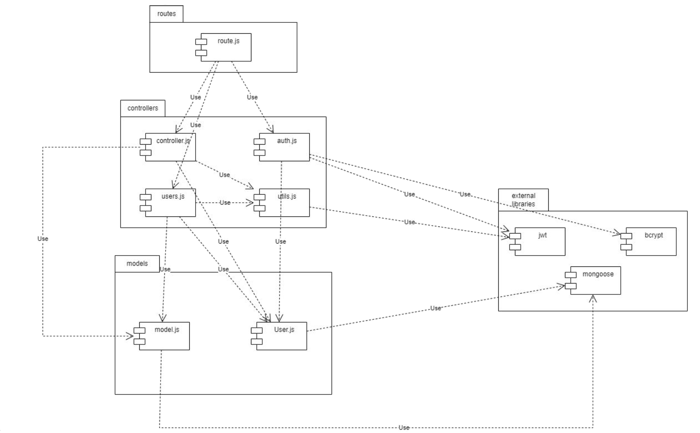
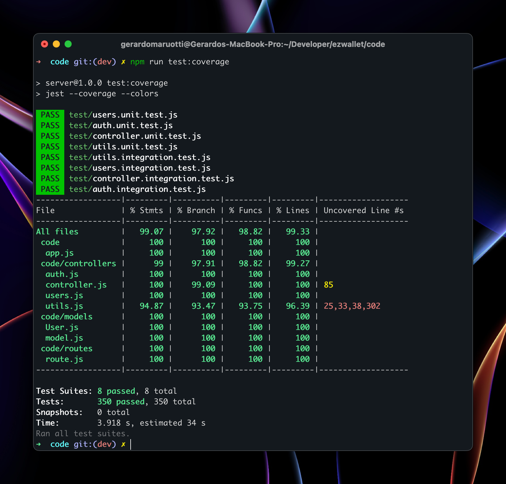

# Test Report

<The goal of this document is to explain how the application was tested, detailing how the test cases were defined and what they cover>

# Contents

- [Dependency graph](#dependency-graph)

- [Integration approach](#integration-approach)

- [Tests](#tests)

- [Coverage](#Coverage)

# Dependency graph

     <report the here the dependency graph of EzWallet>

# Integration approach

    <Write here the integration sequence you adopted, in general terms (top down, bottom up, mixed) and as sequence
    (ex: step1: unit A, step 2: unit A+B, step 3: unit A+B+C, etc)>
    <Some steps may  correspond to unit testing (ex step1 in ex above)>
    <One step will  correspond to API testing, or testing unit route.js>

Integration approach: bottom up

Sequence:

1. Unit testing of the functions in `code/controllers/utils.js`
2. Unit testing of the functions in `code/controllers/auth.js`
3. Unit testing of the functions in `code/controllers/users.js`
4. Unit testing of the functions in `code/controllers/controllers.js`
5. Integration testing of the functions in `code/controllers/utils.js`
6. Integration testing of the functions in `code/controllers/auth.js`
7. Integration testing of the functions in `code/controllers/users.js`
8. Integration testing of the functions in `code/controllers/controllers.js`

# Tests

<in the table below list the test cases defined For each test report the object tested, the test level (API, integration, unit) and the technique used to define the test case (BB/ eq partitioning, BB/ boundary, WB/ statement coverage, etc)> <split the table if needed>

| Test case name | Object(s) tested                                                                                                                      | Test level                       | Technique used |
| -------------- | ------------------------------------------------------------------------------------------------------------------------------------- | -------------------------------- | -------------- | ----------------------- |
| 1              | should return the correct date filter object                                                                                          | handleDateFilterParams           | Unit           | WB - Statement Coverage |
| 2              | should return an empty object if no date filter is provided                                                                           | handleDateFilterParams           | Unit           | WB - Statement Coverage |
| 3              | should throw an error if `date` is present with `from`                                                                                | handleDateFilterParams           | Unit           | WB - Statement Coverage |
| 4              | should throw an error if `date` is present with `upTo`                                                                                | handleDateFilterParams           | Unit           | WB - Statement Coverage |
| 5              | should throw an error if the value of any query parameter is not a valid date                                                         | handleDateFilterParams           | Unit           | WB - Statement Coverage |
| 6              | should return 401 if there is no accessToken                                                                                          | verifyAuth                       | Unit           | WB - Statement Coverage |
| 7              | should return 401 if there is no refreshToken                                                                                         | verifyAuth                       | Unit           | WB - Statement Coverage |
| 8              | should return authorized false if accessToken is missing information                                                                  | verifyAuth                       | Unit           | WB - Statement Coverage |
| 9              | should return authorized false if refreshToken is missing information                                                                 | verifyAuth                       | Unit           | WB - Statement Coverage |
| 10             | should return authorized false if mismatched user information                                                                         | verifyAuth                       | Unit           | WB - Statement Coverage |
| 11             | should return authorized false if username is undefined                                                                               | verifyAuth                       | Unit           | WB - Statement Coverage |
| 12             | should return authorized false if not admin                                                                                           | verifyAuth                       | Unit           | WB - Statement Coverage |
| 13             | should return authorized false if not in group                                                                                        | verifyAuth                       | Unit           | WB - Statement Coverage |
| 14             | should return authorized false if email is not in group                                                                               | verifyAuth                       | Unit           | WB - Statement Coverage |
| 15             | should return authorized true if user is a User                                                                                       | verifyAuth                       | Unit           | WB - Statement Coverage |
| 16             | should return authorized true if user is a User                                                                                       | verifyAuth                       | Unit           | WB - Statement Coverage |
| 17             | should return authorized true if user is in group                                                                                     | verifyAuth                       | Unit           | WB - Statement Coverage |
| 18             | should return authorized true if token expired                                                                                        | verifyAuth                       | Unit           | WB - Statement Coverage |
| 19             | should return authorized false if token expired and jwt throws error TokenExpiredError                                                | verifyAuth                       | Unit           | WB - Statement Coverage |
| 20             | should return authorized false if token expired and jwt throws error                                                                  | verifyAuth                       | Unit           | WB - Statement Coverage |
| 21             | Nominal case                                                                                                                          | register                         | Unit           | WB - Statement Coverage |
| 22             | Undefined username                                                                                                                    | register                         | Unit           | WB - Statement Coverage |
| 23             | Undefined email                                                                                                                       | register                         | Unit           | WB - Statement Coverage |
| 24             | Undefined password                                                                                                                    | register                         | Unit           | WB - Statement Coverage |
| 25             | Empty username                                                                                                                        | register                         | Unit           | WB - Statement Coverage |
| 26             | Empty email                                                                                                                           | register                         | Unit           | WB - Statement Coverage |
| 27             | Empty passowrd                                                                                                                        | register                         | Unit           | WB - Statement Coverage |
| 28             | Empty body                                                                                                                            | register                         | Unit           | WB - Statement Coverage |
| 29             | Wrong email                                                                                                                           | register                         | Unit           | WB - Statement Coverage |
| 30             | Username already used                                                                                                                 | register                         | Unit           | WB - Statement Coverage |
| 31             | Email already used                                                                                                                    | register                         | Unit           | WB - Statement Coverage |
| 32             | Database error                                                                                                                        | register                         | Unit           | WB - Statement Coverage |
| 33             | nominal case                                                                                                                          | registerAdmin                    | Unit           | WB - Statement Coverage |
| 34             | Undefined password                                                                                                                    | registerAdmin                    | Unit           | WB - Statement Coverage |
| 35             | Undefined email                                                                                                                       | registerAdmin                    | Unit           | WB - Statement Coverage |
| 36             | Undefined username                                                                                                                    | registerAdmin                    | Unit           | WB - Statement Coverage |
| 37             | Empty username                                                                                                                        | registerAdmin                    | Unit           | WB - Statement Coverage |
| 38             | Empty email                                                                                                                           | registerAdmin                    | Unit           | WB - Statement Coverage |
| 39             | Empty password                                                                                                                        | registerAdmin                    | Unit           | WB - Statement Coverage |
| 40             | Empty Body                                                                                                                            | registerAdmin                    | Unit           | WB - Statement Coverage |
| 41             | Wrong email                                                                                                                           | registerAdmin                    | Unit           | WB - Statement Coverage |
| 42             | Email already used                                                                                                                    | registerAdmin                    | Unit           | WB - Statement Coverage |
| 43             | Database error                                                                                                                        | registerAdmin                    | Unit           | WB - Statement Coverage |
| 44             | nominal case                                                                                                                          | Login                            | Unit           | WB - Statement Coverage |
| 45             | Undefined email                                                                                                                       | Login                            | Unit           | WB - Statement Coverage |
| 46             | Undefined password                                                                                                                    | Login                            | Unit           | WB - Statement Coverage |
| 47             | Empty password                                                                                                                        | Login                            | Unit           | WB - Statement Coverage |
| 48             | Empty email                                                                                                                           | Login                            | Unit           | WB - Statement Coverage |
| 49             | Existing user                                                                                                                         | Login                            | Unit           | WB - Statement Coverage |
| 50             | Password wrong                                                                                                                        | Login                            | Unit           | WB - Statement Coverage |
| 51             | Database error                                                                                                                        | Login                            | Unit           | WB - Statement Coverage |
| 52             | Nominal case                                                                                                                          | logout                           | Unit           | WB - Statement Coverage |
| 53             | Missing refreshtoken                                                                                                                  | logout                           | Unit           | WB - Statement Coverage |
| 54             | User not found                                                                                                                        | logout                           | Unit           | WB - Statement Coverage |
| 55             | Database error                                                                                                                        | logout                           | Unit           | WB - Statement Coverage |
| 56             | should create new category                                                                                                            | createCategory                   | Unit           | WB - Statement Coverage |
| 57             | should return 401 if not authorized                                                                                                   | createCategory                   | Unit           | WB - Statement Coverage |
| 58             | should return 500 if there is database error                                                                                          | createCategory                   | Unit           | WB - Statement Coverage |
| 59             | should return 400 if category already exists                                                                                          | createCategory                   | Unit           | WB - Statement Coverage |
| 60             | should return 400 if category type is not provided                                                                                    | createCategory                   | Unit           | WB - Statement Coverage |
| 61             | should return 400 if category color is not provided                                                                                   | createCategory                   | Unit           | WB - Statement Coverage |
| 62             | should return 400 if category type is empty                                                                                           | createCategory                   | Unit           | WB - Statement Coverage |
| 63             | should return 400 if category color is empty                                                                                          | createCategory                   | Unit           | WB - Statement Coverage |
| 64             | should throw error if category is not saved correctly                                                                                 | createCategory                   | Unit           | WB - Statement Coverage |
| 65             | should return 401 if not authorized                                                                                                   | updateCategory                   | Unit           | WB - Statement Coverage |
| 66             | should return 400 if category type is empty                                                                                           | updateCategory                   | Unit           | WB - Statement Coverage |
| 67             | should return 400 if category color is empty                                                                                          | updateCategory                   | Unit           | WB - Statement Coverage |
| 68             | should return 400 if param category does not exist                                                                                    | updateCategory                   | Unit           | WB - Statement Coverage |
| 69             | should return 400 if body category already exists                                                                                     | updateCategory                   | Unit           | WB - Statement Coverage |
| 70             | should throw error if category is not updated correctly                                                                               | updateCategory                   | Unit           | WB - Statement Coverage |
| 71             | should return 200 if category is updated correctly                                                                                    | updateCategory                   | Unit           | WB - Statement Coverage |
| 72             | should return 401 if user is not authorized                                                                                           | deleteCategory                   | Unit           | WB - Statement Coverage |
| 73             | should return 400 if types is missing                                                                                                 | deleteCategory                   | Unit           | WB - Statement Coverage |
| 74             | should return 400 if only one category remaining                                                                                      | deleteCategory                   | Unit           | WB - Statement Coverage |
| 75             | should return 400 if category does not exist                                                                                          | deleteCategory                   | Unit           | WB - Statement Coverage |
| 76             | should delete category and update transactions                                                                                        | deleteCategory                   | Unit           | WB - Statement Coverage |
| 77             | should return 500 if an error occurs                                                                                                  | deleteCategory                   | Unit           | WB - Statement Coverage |
| 78             | should return 401 if not authorised                                                                                                   | getCategories                    | Unit           | WB - Statement Coverage |
| 79             | should return 500 if there is database error                                                                                          | getCategories                    | Unit           | WB - Statement Coverage |
| 80             | should return empty list if there are no categories                                                                                   | getCategories                    | Unit           | WB - Statement Coverage |
| 81             | should return list of categories                                                                                                      | getCategories                    | Unit           | WB - Statement Coverage |
| 82             | should return 401 if user is not authorized                                                                                           | createTransaction                | Unit           | WB - Statement Coverage |
| 83             | should return 400 if category does not exist                                                                                          | createTransaction                | Unit           | WB - Statement Coverage |
| 84             | should return 400 if user does not exist                                                                                              | createTransaction                | Unit           | WB - Statement Coverage |
| 85             | should return 500 if there is database error                                                                                          | createTransaction                | Unit           | WB - Statement Coverage |
| 86             | should create transaction and return data                                                                                             | createTransaction                | Unit           | WB - Statement Coverage |
| 87             | should return 401 if not authorised                                                                                                   | getAllTransactions               | Unit           | WB - Statement Coverage |
| 88             | should return 500 if there is database error                                                                                          | getAllTransactions               | Unit           | WB - Statement Coverage |
| 89             | should return empty list if there are no transactions                                                                                 | getAllTransactions               | Unit           | WB - Statement Coverage |
| 90             | should return list of transactions                                                                                                    | getAllTransactions               | Unit           | WB - Statement Coverage |
| 91             | should return 401 if user is not authorized                                                                                           | getTransactionsByUser            | Unit           | WB - Statement Coverage |
| 92             | should return 400 if username is missing                                                                                              | getTransactionsByUser            | Unit           | WB - Statement Coverage |
| 93             | should return 400 if user does not exist                                                                                              | getTransactionsByUser            | Unit           | WB - Statement Coverage |
| 94             | should return transactions for user                                                                                                   | getTransactionsByUser            | Unit           | WB - Statement Coverage |
| 95             | should return empty list if user has no transactions                                                                                  | getTransactionsByUser            | Unit           | WB - Statement Coverage |
| 96             | should return 401 if user is not authorized                                                                                           | getTransactionsByUser            | Unit           | WB - Statement Coverage |
| 97             | should return transactions for user with filters                                                                                      | getTransactionsByUser            | Unit           | WB - Statement Coverage |
| 98             | should return transactions for user without filters                                                                                   | getTransactionsByUser            | Unit           | WB - Statement Coverage |
| 99             | should return 500 if an error occurs                                                                                                  | getTransactionsByUser            | Unit           | WB - Statement Coverage |
| 100            | should return empty list if user has no transactions                                                                                  | getTransactionsByUser            | Unit           | WB - Statement Coverage |
| 101            | should return 401 if user is not authorized                                                                                           | getTransactionsByUserByCategory  | Unit           | WB - Statement Coverage |
| 102            | should return 400 if username is missing                                                                                              | getTransactionsByUserByCategory  | Unit           | WB - Statement Coverage |
| 103            | should return 400 if type is missing                                                                                                  | getTransactionsByUserByCategory  | Unit           | WB - Statement Coverage |
| 104            | should return 400 if user does not exist                                                                                              | getTransactionsByUserByCategory  | Unit           | WB - Statement Coverage |
| 105            | should return 400 if type does not exist                                                                                              | getTransactionsByUserByCategory  | Unit           | WB - Statement Coverage |
| 106            | should return transactions for user                                                                                                   | getTransactionsByUserByCategory  | Unit           | WB - Statement Coverage |
| 107            | should return 500 if an error occurs                                                                                                  | getTransactionsByUserByCategory  | Unit           | WB - Statement Coverage |
| 108            | should return empty list if user has no transactions                                                                                  | getTransactionsByUserByCategory  | Unit           | WB - Statement Coverage |
| 109            | should return 401 if user is not authorized                                                                                           | getTransactionsByGroup           | Unit           | WB - Statement Coverage |
| 110            | should return 401 if admin not authorized                                                                                             | getTransactionsByGroup           | Unit           | WB - Statement Coverage |
| 111            | should return 400 if group name is missing                                                                                            | getTransactionsByGroup           | Unit           | WB - Statement Coverage |
| 112            | should return 400 if Group does not exist                                                                                             | getTransactionsByGroup           | Unit           | WB - Statement Coverage |
| 113            | should return transactions for group                                                                                                  | getTransactionsByGroup           | Unit           | WB - Statement Coverage |
| 114            | should return 500 if an error occurs                                                                                                  | getTransactionsByGroup           | Unit           | WB - Statement Coverage |
| 115            | should return 401 if user is not authorized                                                                                           | getTransactionsByGroupByCategory | Unit           | WB - Statement Coverage |
| 116            | should return 400 if group name is missing                                                                                            | getTransactionsByGroupByCategory | Unit           | WB - Statement Coverage |
| 117            | should return 400 if Group does not exist                                                                                             | getTransactionsByGroupByCategory | Unit           | WB - Statement Coverage |
| 118            | should return 400 if type is missing                                                                                                  | getTransactionsByGroupByCategory | Unit           | WB - Statement Coverage |
| 119            | should return 400 if type does not exist                                                                                              | getTransactionsByGroupByCategory | Unit           | WB - Statement Coverage |
| 120            | should return 401 if admin not authorized                                                                                             | getTransactionsByGroupByCategory | Unit           | WB - Statement Coverage |
| 121            | should return transactions for group                                                                                                  | getTransactionsByGroupByCategory | Unit           | WB - Statement Coverage |
| 122            | should return 500 if an error occurs                                                                                                  | getTransactionsByGroupByCategory | Unit           | WB - Statement Coverage |
| 123            | should return 401 if user is not authorized                                                                                           | deleteTransaction                | Unit           | WB - Statement Coverage |
| 124            | should return 400 if id is missing                                                                                                    | deleteTransaction                | Unit           | WB - Statement Coverage |
| 125            | should return 400 if user does not exist                                                                                              | deleteTransaction                | Unit           | WB - Statement Coverage |
| 126            | should return 400 if transaction does not exist                                                                                       | deleteTransaction                | Unit           | WB - Statement Coverage |
| 127            | should delete transaction                                                                                                             | deleteTransaction                | Unit           | WB - Statement Coverage |
| 128            | should return 400 if an error occurs                                                                                                  | deleteTransaction                | Unit           | WB - Statement Coverage |
| 129            | should return 401 if user is not authorized                                                                                           | deleteTransactions               | Unit           | WB - Statement Coverage |
| 130            | should return 400 if id list is missing                                                                                               | deleteTransactions               | Unit           | WB - Statement Coverage |
| 131            | should return 400 if id list is empty                                                                                                 | deleteTransactions               | Unit           | WB - Statement Coverage |
| 132            | should return 400 if any id is empty                                                                                                  | deleteTransactions               | Unit           | WB - Statement Coverage |
| 133            | should return 400 if any id is not found                                                                                              | deleteTransactions               | Unit           | WB - Statement Coverage |
| 134            | should return 400 if an error occurs                                                                                                  | deleteTransactions               | Unit           | WB - Statement Coverage |
| 135            | should delete transactions                                                                                                            | deleteTransactions               | Unit           | WB - Statement Coverage |
| 136            | should return 401 if not authorised                                                                                                   | getUsers                         | Unit           | WB - Statement Coverage |
| 137            | should return 500 if there is database error                                                                                          | getUsers                         | Unit           | WB - Statement Coverage |
| 138            | should return empty list if there are no users                                                                                        | getUsers                         | Unit           | WB - Statement Coverage |
| 139            | should return list of all users                                                                                                       | getUsers                         | Unit           | WB - Statement Coverage |
| 140            | should return 401 if not authorized                                                                                                   | getUser                          | Unit           | WB - Statement Coverage |
| 141            | should return 400 if user does not exist                                                                                              | getUser                          | Unit           | WB - Statement Coverage |
| 142            | should return 500 if there is database error                                                                                          | getUser                          | Unit           | WB - Statement Coverage |
| 143            | should return user data                                                                                                               | getUser                          | Unit           | WB - Statement Coverage |
| 144            | should return 401 if not authorized                                                                                                   | createGroup                      | Unit           | WB - Statement Coverage |
| 145            | should return 400 if group name is not provided                                                                                       | createGroup                      | Unit           | WB - Statement Coverage |
| 146            | should return 400 if group name is a empty string                                                                                     | createGroup                      | Unit           | WB - Statement Coverage |
| 147            | should return 400 if member emails are not provided                                                                                   | createGroup                      | Unit           | WB - Statement Coverage |
| 148            | should return 400 if group already exists                                                                                             | createGroup                      | Unit           | WB - Statement Coverage |
| 149            | should return 400 if there aren\                                                                                                      | createGroup                      | Unit           | WB - Statement Coverage |
| 150            | should return 400 if user is already in a group                                                                                       | createGroup                      | Unit           | WB - Statement Coverage |
| 151            | should return 400 if there are almost one email invalid or empty                                                                      | createGroup                      | Unit           | WB - Statement Coverage |
| 152            | should return 500 if there is database error                                                                                          | createGroup                      | Unit           | WB - Statement Coverage |
| 153            | should return created group                                                                                                           | createGroup                      | Unit           | WB - Statement Coverage |
| 154            | should return created group with user email                                                                                           | createGroup                      | Unit           | WB - Statement Coverage |
| 155            | should return 401 if not authorized                                                                                                   | getGroups                        | Unit           | WB - Statement Coverage |
| 156            | should return 500 if there is database error                                                                                          | getGroups                        | Unit           | WB - Statement Coverage |
| 157            | should return empty list if there are no groups                                                                                       | getGroups                        | Unit           | WB - Statement Coverage |
| 158            | should return list of all groups                                                                                                      | getGroups                        | Unit           | WB - Statement Coverage |
| 159            | should return 400 if a group does not exist                                                                                           | getGroup                         | Unit           | WB - Statement Coverage |
| 160            | should return 401 if not authorized                                                                                                   | getGroup                         | Unit           | WB - Statement Coverage |
| 161            | should return 500 if there is database error                                                                                          | getGroup                         | Unit           | WB - Statement Coverage |
| 162            | should return group data                                                                                                              | getGroup                         | Unit           | WB - Statement Coverage |
| 163            | should return 401 if not authorized                                                                                                   | addToGroup                       | Unit           | WB - Statement Coverage |
| 164            | should return 401 if not authorized ad admin                                                                                          | addToGroup                       | Unit           | WB - Statement Coverage |
| 165            | should return 400 if group name is not provided                                                                                       | addToGroup                       | Unit           | WB - Statement Coverage |
| 166            | should return 400 if member emails are not provided                                                                                   | addToGroup                       | Unit           | WB - Statement Coverage |
| 167            | should return 400 if group does not exist                                                                                             | addToGroup                       | Unit           | WB - Statement Coverage |
| 168            | should return 400 if the path is wrong                                                                                                | addToGroup                       | Unit           | WB - Statement Coverage |
| 169            | should return 400 if emails are not valid                                                                                             | addToGroup                       | Unit           | WB - Statement Coverage |
| 170            | should return 400 if there aren\                                                                                                      | addToGroup                       | Unit           | WB - Statement Coverage |
| 171            | should return 500 if there is database error                                                                                          | addToGroup                       | Unit           | WB - Statement Coverage |
| 172            | should return the group with the new members                                                                                          | addToGroup                       | Unit           | WB - Statement Coverage |
| 173            | should return the group with the new members if admin                                                                                 | addToGroup                       | Unit           | WB - Statement Coverage |
| 174            | should return 401 if not authorized                                                                                                   | removeFromGroup                  | Unit           | WB - Statement Coverage |
| 175            | should return 401 if not authorized as admin                                                                                          | removeFromGroup                  | Unit           | WB - Statement Coverage |
| 176            | should return 400 if emails are not provided                                                                                          | removeFromGroup                  | Unit           | WB - Statement Coverage |
| 177            | should return 400 if group does not exist                                                                                             | removeFromGroup                  | Unit           | WB - Statement Coverage |
| 178            | should return 400 if the path is not valid                                                                                            | removeFromGroup                  | Unit           | WB - Statement Coverage |
| 179            | should return 400 if emails are not valid                                                                                             | removeFromGroup                  | Unit           | WB - Statement Coverage |
| 180            | should return 400 if there aren\                                                                                                      | removeFromGroup                  | Unit           | WB - Statement Coverage |
| 181            | should return 400 if the group will be empty                                                                                          | removeFromGroup                  | Unit           | WB - Statement Coverage |
| 182            | should return 500 if there is database error                                                                                          | removeFromGroup                  | Unit           | WB - Statement Coverage |
| 183            | should return the group with the removed members                                                                                      | removeFromGroup                  | Unit           | WB - Statement Coverage |
| 184            | should return the group with the removed members if admin                                                                             | removeFromGroup                  | Unit           | WB - Statement Coverage |
| 185            | should return 401 if not authorized                                                                                                   | deleteUser                       | Unit           | WB - Statement Coverage |
| 186            | should return 400 if email is undefined                                                                                               | deleteUser                       | Unit           | WB - Statement Coverage |
| 187            | should return 400 if email is not valid                                                                                               | deleteUser                       | Unit           | WB - Statement Coverage |
| 188            | should return 400 if user does not exist                                                                                              | deleteUser                       | Unit           | WB - Statement Coverage |
| 189            | should return 400 if user is admin                                                                                                    | deleteUser                       | Unit           | WB - Statement Coverage |
| 190            | should return 500 if there is database error                                                                                          | deleteUser                       | Unit           | WB - Statement Coverage |
| 191            | should return 200 if user is deleted                                                                                                  | deleteUser                       | Unit           | WB - Statement Coverage |
| 192            | should return 200 if user is deleted and there isn\                                                                                   | deleteUser                       | Unit           | WB - Statement Coverage |
| 193            | should return 401 if not authorized                                                                                                   | deleteGroup                      | Unit           | WB - Statement Coverage |
| 194            | should return 400 if group name is not provided                                                                                       | deleteGroup                      | Unit           | WB - Statement Coverage |
| 195            | should return 400 if group name is an empty string                                                                                    | deleteGroup                      | Unit           | WB - Statement Coverage |
| 196            | should return 400 if group does not exist                                                                                             | deleteGroup                      | Unit           | WB - Statement Coverage |
| 197            | should return 500 if there is database error                                                                                          | deleteGroup                      | Unit           | WB - Statement Coverage |
| 198            | should return a message if group is deleted                                                                                           | deleteGroup                      | Unit           | WB - Statement Coverage |
| 199            | Tokens are both valid and belong to the requested user                                                                                | utils.js                         | Integration    | WB - Statement Coverage |
| 200            | Undefined tokens                                                                                                                      | utils.js                         | Integration    | WB - Statement Coverage |
| 201            | Access token expired and refresh token belonging to the requested user                                                                | utils.js                         | Integration    | WB - Statement Coverage |
| 202            | Tokens are both valid and belong to the requested user and to be false accessToken missing email                                      | utils.js                         | Integration    | WB - Statement Coverage |
| 203            | Tokens are both valid and belong to the requested user and to be false accessToken username                                           | utils.js                         | Integration    | WB - Statement Coverage |
| 204            | Tokens are both valid and belong to the requested user and to be false accessToken role                                               | utils.js                         | Integration    | WB - Statement Coverage |
| 205            | Tokens are both valid and belong to the requested user and to be false RefreshToken missing email                                     | utils.js                         | Integration    | WB - Statement Coverage |
| 206            | Tokens are both valid and belong to the requested user and to be false RefreshToken username                                          | utils.js                         | Integration    | WB - Statement Coverage |
| 207            | Tokens are both valid and belong to the requested user and to be false RefreshToken role                                              | utils.js                         | Integration    | WB - Statement Coverage |
| 208            | Tokens are both valid but both token have different users                                                                             | utils.js                         | Integration    | WB - Statement Coverage |
| 209            | Tokens are both valid but user is not the same as the one in the params                                                               | utils.js                         | Integration    | WB - Statement Coverage |
| 210            | Tokens is from a user trying to pass as an admin it should give an error                                                              | utils.js                         | Integration    | WB - Statement Coverage |
| 211            | Tokens is from a user trying to pass as a member of a group he is not in it should give an error                                      | utils.js                         | Integration    | WB - Statement Coverage |
| 212            | expired refresh token->user should loggin again message                                                                               | utils.js                         | Integration    | WB - Statement Coverage |
| 213            | Nominal case: a confirmation message must be returned                                                                                 | register                         | Integration    | WB - Statement Coverage |
| 214            | Username undefined: a 400 error message must be returned                                                                              | register                         | Integration    | WB - Statement Coverage |
| 215            | Email undefined: a 400 error message must be returned                                                                                 | register                         | Integration    | WB - Statement Coverage |
| 216            | Password undefined: a 400 error message must be returned                                                                              | register                         | Integration    | WB - Statement Coverage |
| 217            | Empty username: a 400 error message must be returned                                                                                  | register                         | Integration    | WB - Statement Coverage |
| 218            | Empty email: a 400 error message must be returned                                                                                     | register                         | Integration    | WB - Statement Coverage |
| 219            | Empty password: a 400 error message must be returned                                                                                  | register                         | Integration    | WB - Statement Coverage |
| 220            | Valid or invalid email: a 400 error message must be returned in case of invalid email                                                 | register                         | Integration    | WB - Statement Coverage |
| 221            | User already register : a 400 error message must be returned in case of invalid email                                                 | register                         | Integration    | WB - Statement Coverage |
| 222            | Nominal case: a confirmation message must be returned                                                                                 | registerAdmin                    | Integration    | WB - Statement Coverage |
| 223            | Username undefined: a 400 error message must be returned                                                                              | registerAdmin                    | Integration    | WB - Statement Coverage |
| 224            | Email undefined: a 400 error message must be returned                                                                                 | registerAdmin                    | Integration    | WB - Statement Coverage |
| 225            | Password undefined: a 400 error message must be returned                                                                              | registerAdmin                    | Integration    | WB - Statement Coverage |
| 226            | Empty username: a 400 error message must be returned                                                                                  | registerAdmin                    | Integration    | WB - Statement Coverage |
| 227            | Empty email: a 400 error message must be returned                                                                                     | registerAdmin                    | Integration    | WB - Statement Coverage |
| 228            | Empty password: a 400 error message must be returned                                                                                  | registerAdmin                    | Integration    | WB - Statement Coverage |
| 229            | Valid or invalid email: a 400 error message must be returned in case of invalid email                                                 | registerAdmin                    | Integration    | WB - Statement Coverage |
| 230            | User already register : a 400 error message must be returned in case of invalid email                                                 | registerAdmin                    | Integration    | WB - Statement Coverage |
| 231            | nominal case                                                                                                                          | login                            | Integration    | WB - Statement Coverage |
| 232            | Empty email: a 400 error message must be returned                                                                                     | login                            | Integration    | WB - Statement Coverage |
| 233            | Empty password: a 400 error message must be returned                                                                                  | login                            | Integration    | WB - Statement Coverage |
| 234            | Email undefined: a 400 error message must be returned                                                                                 | login                            | Integration    | WB - Statement Coverage |
| 235            | Password undefined: a 400 error message must be returned                                                                              | login                            | Integration    | WB - Statement Coverage |
| 236            | Invalid password: a 400 error message must be returned                                                                                | login                            | Integration    | WB - Statement Coverage |
| 237            | Invalid email: a 400 error message must be returned                                                                                   | login                            | Integration    | WB - Statement Coverage |
| 238            | Nominal case                                                                                                                          | logout                           | Integration    | WB - Statement Coverage |
| 239            | Missing cookie: a 400 error message must be returned                                                                                  | logout                           | Integration    | WB - Statement Coverage |
| 240            | Invalid cookie: a 400 error message must be returned                                                                                  | logout                           | Integration    | WB - Statement Coverage |
| 241            | Should create a category and return it                                                                                                | createCategory                   | Integration    | WB - Statement Coverage |
| 242            | Should return 401 if not authorized                                                                                                   | createCategory                   | Integration    | WB - Statement Coverage |
| 243            | Should return 400 if missing color                                                                                                    | createCategory                   | Integration    | WB - Statement Coverage |
| 244            | Should return 400 if missing type                                                                                                     | createCategory                   | Integration    | WB - Statement Coverage |
| 245            | Returns a message for confirmation and the number of updated transactions                                                             | updateCategory                   | Integration    | WB - Statement Coverage |
| 246            | Returns a message for confirmation and the number of updated transactions                                                             | updateCategory                   | Integration    | WB - Statement Coverage |
| 247            | Returns a 400 error if the type of the new category is the same as one that exists already and that category is not the requested one | updateCategory                   | Integration    | WB - Statement Coverage |
| 248            | Returns a 400 error if the type of the old category does not exist                                                                    | updateCategory                   | Integration    | WB - Statement Coverage |
| 249            | Returns a 400 error if the request body does not contain all the necessary parameters                                                 | updateCategory                   | Integration    | WB - Statement Coverage |
| 250            | Returns a 401 error if called by a user who is not an Admin                                                                           | updateCategory                   | Integration    | WB - Statement Coverage |
| 251            | should return 401 if not authorized                                                                                                   | deleteCategory                   | Integration    | WB - Statement Coverage |
| 252            | should return 400 if missing types                                                                                                    | deleteCategory                   | Integration    | WB - Statement Coverage |
| 253            | should return 400 if types is empty                                                                                                   | deleteCategory                   | Integration    | WB - Statement Coverage |
| 254            | should return 400 id there is only one category remaining                                                                             | deleteCategory                   | Integration    | WB - Statement Coverage |
| 255            | should return 400 if one of the categories does not exist                                                                             | deleteCategory                   | Integration    | WB - Statement Coverage |
| 256            | should return 200 if all categories are deleted                                                                                       | deleteCategory                   | Integration    | WB - Statement Coverage |
| 257            | should return 200 if all categories are deleted and transactions are updated                                                          | deleteCategory                   | Integration    | WB - Statement Coverage |
| 258            | Nominal case: returns a list of categories                                                                                            | getCategories                    | Integration    | WB - Statement Coverage |
| 259            | Should return 401 if not authorized                                                                                                   | getCategories                    | Integration    | WB - Statement Coverage |
| 260            | Should return 401 if not authorized                                                                                                   | createTransaction                | Integration    | WB - Statement Coverage |
| 261            | Should return 400 if the user does not exist                                                                                          | createTransaction                | Integration    | WB - Statement Coverage |
| 262            | Should return 400 if category does not exist                                                                                          | createTransaction                | Integration    | WB - Statement Coverage |
| 263            | Should create a category and return it                                                                                                | createTransaction                | Integration    | WB - Statement Coverage |
| 264            | should return 401 if not authorized                                                                                                   | getAllTransactions               | Integration    | WB - Statement Coverage |
| 265            | should return 200 if authorized                                                                                                       | getAllTransactions               | Integration    | WB - Statement Coverage |
| 266            | should return 400 if no user is found with provided username                                                                          | getTransactionsByUser            | Integration    | WB - Statement Coverage |
| 267            | should return 401 if not authorized                                                                                                   | getTransactionsByUser            | Integration    | WB - Statement Coverage |
| 268            | should return 200 if authorized                                                                                                       | getTransactionsByUser            | Integration    | WB - Statement Coverage |
| 269            | should return 200 if authorized and filter query                                                                                      | getTransactionsByUser            | Integration    | WB - Statement Coverage |
| 270            | should return 500 if no categories defined                                                                                            | getTransactionsByUser            | Integration    | WB - Statement Coverage |
| 271            | should return 401 if not admin in admin path                                                                                          | getTransactionsByUser            | Integration    | WB - Statement Coverage |
| 272            | should return 200 and empty list if no user transactions                                                                              | getTransactionsByUser            | Integration    | WB - Statement Coverage |
| 273            | should return 200 and list of user transactions                                                                                       | getTransactionsByUser            | Integration    | WB - Statement Coverage |
| 274            | should return 401 if not authorized                                                                                                   | getTransactionsByUserByCategory  | Integration    | WB - Statement Coverage |
| 275            | should return 400 if category is not found                                                                                            | getTransactionsByUserByCategory  | Integration    | WB - Statement Coverage |
| 276            | should return 400 if user is not found                                                                                                | getTransactionsByUserByCategory  | Integration    | WB - Statement Coverage |
| 277            | should return 200                                                                                                                     | getTransactionsByUserByCategory  | Integration    | WB - Statement Coverage |
| 278            | should return 200                                                                                                                     | getTransactionsByUserByCategory  | Integration    | WB - Statement Coverage |
| 279            | should return 401 if not authorized                                                                                                   | getTransactionsByGroup           | Integration    | WB - Statement Coverage |
| 280            | should return 400 if group is not found                                                                                               | getTransactionsByGroup           | Integration    | WB - Statement Coverage |
| 281            | should return 200                                                                                                                     | getTransactionsByGroup           | Integration    | WB - Statement Coverage |
| 282            | should return 200 if admin path                                                                                                       | getTransactionsByGroup           | Integration    | WB - Statement Coverage |
| 283            | should return 401 if not authorized                                                                                                   | getTransactionsByGroupByCategory | Integration    | WB - Statement Coverage |
| 284            | should return 400 if group is not found                                                                                               | getTransactionsByGroupByCategory | Integration    | WB - Statement Coverage |
| 285            | should return 400 if category is not found                                                                                            | getTransactionsByGroupByCategory | Integration    | WB - Statement Coverage |
| 286            | should return 200                                                                                                                     | getTransactionsByGroupByCategory | Integration    | WB - Statement Coverage |
| 287            | should return 401 of not admin on admin path                                                                                          | getTransactionsByGroupByCategory | Integration    | WB - Statement Coverage |
| 288            | should return 200 if admin path                                                                                                       | getTransactionsByGroupByCategory | Integration    | WB - Statement Coverage |
| 289            | should return 401 if not authorized                                                                                                   | deleteTransaction                | Integration    | WB - Statement Coverage |
| 290            | should return 400 if ids are not provided                                                                                             | deleteTransaction                | Integration    | WB - Statement Coverage |
| 291            | should return 400 if user does not exist                                                                                              | deleteTransaction                | Integration    | WB - Statement Coverage |
| 292            | should return 200 if transaction is deleted                                                                                           | deleteTransaction                | Integration    | WB - Statement Coverage |
| 293            | should return 400 if transaction does not exist                                                                                       | deleteTransaction                | Integration    | WB - Statement Coverage |
| 294            | should return 401 if not authorized                                                                                                   | deleteTransactions               | Integration    | WB - Statement Coverage |
| 295            | should return 400 if ids are not provided                                                                                             | deleteTransactions               | Integration    | WB - Statement Coverage |
| 296            | should return 400 if ids ais an ampty array                                                                                           | deleteTransactions               | Integration    | WB - Statement Coverage |
| 297            | should return 400 if one ef ids element is empty                                                                                      | deleteTransactions               | Integration    | WB - Statement Coverage |
| 298            | should return 400 if one or more ids are not found                                                                                    | deleteTransactions               | Integration    | WB - Statement Coverage |
| 299            | should return 200 if all ids are found                                                                                                | deleteTransactions               | Integration    | WB - Statement Coverage |
| 300            | should return empty list if there are no users                                                                                        | getUsers                         | Integration    | WB - Statement Coverage |
| 301            | Nominal case: should retrieve list of all users                                                                                       | getUsers                         | Integration    | WB - Statement Coverage |
| 302            | Should return an error if the access token are empty                                                                                  | getUsers                         | Integration    | WB - Statement Coverage |
| 303            | Should return an error 400 if there are no users                                                                                      | getUser                          | Integration    | WB - Statement Coverage |
| 304            | Nominal case: should retrieve user                                                                                                    | getUser                          | Integration    | WB - Statement Coverage |
| 305            | Should return an error if the access token are empty                                                                                  | getUser                          | Integration    | WB - Statement Coverage |
| 306            | Nominal case: should create a group                                                                                                   | createGroup                      | Integration    | WB - Statement Coverage |
| 307            | Should return an error if the request body is empty                                                                                   | createGroup                      | Integration    | WB - Statement Coverage |
| 308            | Should return an error if the access token are empty                                                                                  | createGroup                      | Integration    | WB - Statement Coverage |
| 309            | Should return an error if the group name is empty                                                                                     | createGroup                      | Integration    | WB - Statement Coverage |
| 310            | Should return an error if the group name is already taken                                                                             | createGroup                      | Integration    | WB - Statement Coverage |
| 311            | Should return an error if the email are not well formatted                                                                            | createGroup                      | Integration    | WB - Statement Coverage |
| 312            | Should return an error if emails are invalid                                                                                          | createGroup                      | Integration    | WB - Statement Coverage |
| 313            | Should return an error if user is already in a group                                                                                  | createGroup                      | Integration    | WB - Statement Coverage |
| 314            | Should return an error if the access token are empty                                                                                  | getGroups                        | Integration    | WB - Statement Coverage |
| 315            | Nominal case: should retrieve list of all groups                                                                                      | getGroups                        | Integration    | WB - Statement Coverage |
| 316            | A group already exists!                                                                                                               | getGroup                         | Integration    | WB - Statement Coverage |
| 317            | Should return an error if the access token are empty                                                                                  | getGroup                         | Integration    | WB - Statement Coverage |
| 318            | A group already exists!                                                                                                               | getGroup                         | Integration    | WB - Statement Coverage |
| 319            | should add members to a group                                                                                                         | addToGroup                       | Integration    | WB - Statement Coverage |
| 320            | An error should be return if there is not request in the body                                                                         | addToGroup                       | Integration    | WB - Statement Coverage |
| 321            | An error should be return if a group does not exist!                                                                                  | addToGroup                       | Integration    | WB - Statement Coverage |
| 322            | Access token invalid in the case of add path                                                                                          | addToGroup                       | Integration    | WB - Statement Coverage |
| 323            | Access token invalid in the case of insert path                                                                                       | addToGroup                       | Integration    | WB - Statement Coverage |
| 324            | Invalid path                                                                                                                          | addToGroup                       | Integration    | WB - Statement Coverage |
| 325            | should return an error if all member emails are already in a group or do not exist                                                    | addToGroup                       | Integration    | WB - Statement Coverage |
| 326            | An error should be return if one or more are not correctly formatted!                                                                 | addToGroup                       | Integration    | WB - Statement Coverage |
| 327            | Nominal case: should remove a user from a group                                                                                       | removeFromGroup                  | Integration    | WB - Statement Coverage |
| 328            | Should return an error if body is empty                                                                                               | removeFromGroup                  | Integration    | WB - Statement Coverage |
| 329            | Should return an error if the users arent registered                                                                                  | removeFromGroup                  | Integration    | WB - Statement Coverage |
| 330            | Should return an error if the group doesnt exist                                                                                      | removeFromGroup                  | Integration    | WB - Statement Coverage |
| 331            | Should return an error if the emails are empty                                                                                        | removeFromGroup                  | Integration    | WB - Statement Coverage |
| 332            | Should return an error if the access token are empty                                                                                  | removeFromGroup                  | Integration    | WB - Statement Coverage |
| 333            | Should return an error if the user is not in the group                                                                                | removeFromGroup                  | Integration    | WB - Statement Coverage |
| 334            | Should return an error if try to delete all the users in the group                                                                    | removeFromGroup                  | Integration    | WB - Statement Coverage |
| 335            | Should delete the user from the group                                                                                                 | deleteUser                       | Integration    | WB - Statement Coverage |
| 336            | should retrun 401 if the user is not logged in                                                                                        | deleteUser                       | Integration    | WB - Statement Coverage |
| 337            | should return 400 if the email is not correct formatted                                                                               | deleteUser                       | Integration    | WB - Statement Coverage |
| 338            | should return 400 if email is not defined                                                                                             | deleteUser                       | Integration    | WB - Statement Coverage |
| 339            | should return 400 if the user is not found                                                                                            | deleteUser                       | Integration    | WB - Statement Coverage |
| 340            | group deleted                                                                                                                         | deleteGroup                      | Integration    | WB - Statement Coverage |
| 341            | not authorize                                                                                                                         | deleteGroup                      | Integration    | WB - Statement Coverage |
| 342            | should give error if missing parameters                                                                                               | deleteGroup                      | Integration    | WB - Statement Coverage |
| 343            | should give error if empty name parameter                                                                                             | deleteGroup                      | Integration    | WB - Statement Coverage |
| 344            | should give error if group not found                                                                                                  | deleteGroup                      | Integration    | WB - Statement Coverage |

# Coverage

## Coverage of FR

<Report in the following table the coverage of functional requirements (from official requirements) >

| Functional Requirements covered  | Test(s)                                                                                                                                                                                                                                                                                                                                                                                                                                                                                                                                                                                                                                                                                                                                                                                                                                                                                                                                                                                                                                                                                                                                                                                                                                                                                                                                                                                           |
| -------------------------------- | ------------------------------------------------------------------------------------------------------------------------------------------------------------------------------------------------------------------------------------------------------------------------------------------------------------------------------------------------------------------------------------------------------------------------------------------------------------------------------------------------------------------------------------------------------------------------------------------------------------------------------------------------------------------------------------------------------------------------------------------------------------------------------------------------------------------------------------------------------------------------------------------------------------------------------------------------------------------------------------------------------------------------------------------------------------------------------------------------------------------------------------------------------------------------------------------------------------------------------------------------------------------------------------------------------------------------------------------------------------------------------------------------- |
| register                         | ['Nominal case', 'Unit', ['Undefined username', 'Unit'], ['Undefined email', 'Unit'], ['Undefined password', 'Unit'], ['Empty username', 'Unit'], ['Empty email', 'Unit'], ['Empty passowrd', 'Unit'], ['Empty body', 'Unit'], ['Wrong email ', 'Unit'], ['Username already used', 'Unit'], ['Email already used', 'Unit'], ['Database error', 'Unit'], ['Nominal case: a confirmation message must be returned', 'Integration'], ['Username undefined: a 400 error message must be returned ', 'Integration'], ['Email undefined: a 400 error message must be returned ', 'Integration'], ['Password undefined: a 400 error message must be returned ', 'Integration'], ['Empty username: a 400 error message must be returned ', 'Integration'], ['Empty email: a 400 error message must be returned ', 'Integration'], ['Empty password: a 400 error message must be returned ', 'Integration'], ['Valid or invalid email: a 400 error message must be returned in case of invalid email', 'Integration'], ['User already register : a 400 error message must be returned in case of invalid email', 'Integration']]                                                                                                                                                                                                                                                                           |
| registerAdmin                    | ['nominal case', 'Unit', ['Undefined password', 'Unit'], ['Undefined email', 'Unit'], ['Undefined username', 'Unit'], ['Empty username', 'Unit'], ['Empty email', 'Unit'], ['Empty password', 'Unit'], ['Empty Body', 'Unit'], ['Wrong email', 'Unit'], ['Email already used', 'Unit'], ['Database error', 'Unit'], ['Nominal case: a confirmation message must be returned', 'Integration'], ['Username undefined: a 400 error message must be returned ', 'Integration'], ['Email undefined: a 400 error message must be returned ', 'Integration'], ['Password undefined: a 400 error message must be returned ', 'Integration'], ['Empty username: a 400 error message must be returned ', 'Integration'], ['Empty email: a 400 error message must be returned ', 'Integration'], ['Empty password: a 400 error message must be returned ', 'Integration'], ['Valid or invalid email: a 400 error message must be returned in case of invalid email', 'Integration'], ['User already register : a 400 error message must be returned in case of invalid email', 'Integration']]                                                                                                                                                                                                                                                                                                               |
| Login                            | ['nominal case', 'Unit', ['Undefined email', 'Unit'], ['Undefined password', 'Unit'], ['Empty password', 'Unit'], ['Empty email', 'Unit'], ['Existing user', 'Unit'], ['Password wrong', 'Unit'], ['Database error', 'Unit']]                                                                                                                                                                                                                                                                                                                                                                                                                                                                                                                                                                                                                                                                                                                                                                                                                                                                                                                                                                                                                                                                                                                                                                     |
| logout                           | ['Nominal case', 'Unit', ['Missing refreshtoken', 'Unit'], [' User not found', 'Unit'], ['Database error', 'Unit'], ['Nominal case', 'Integration'], ['Missing cookie: a 400 error message must be returned', 'Integration'], ['Invalid cookie: a 400 error message must be returned', 'Integration']]                                                                                                                                                                                                                                                                                                                                                                                                                                                                                                                                                                                                                                                                                                                                                                                                                                                                                                                                                                                                                                                                                            |
| createCategory                   | ['should create new category', 'Unit', ['should return 401 if not authorized', 'Unit'], ['should return 500 if there is database error', 'Unit'], ['should return 400 if category already exists', 'Unit'], ['should return 400 if category type is not provided', 'Unit'], ['should return 400 if category color is not provided', 'Unit'], ['should return 400 if category type is empty', 'Unit'], ['should return 400 if category color is empty', 'Unit'], ['should throw error if category is not saved correctly', 'Unit'], ['Should create a category and return it', 'Integration'], ['Should return 401 if not authorized', 'Integration'], ['Should return 400 if missing color', 'Integration'], ['Should return 400 if missing type', 'Integration']]                                                                                                                                                                                                                                                                                                                                                                                                                                                                                                                                                                                                                                |
| updateCategory                   | ['should return 401 if not authorized', 'Unit', ['should return 400 if category type is empty', 'Unit'], ['should return 400 if category color is empty', 'Unit'], ['should return 400 if param category does not exist', 'Unit'], ['should return 400 if body category already exists', 'Unit'], ['should throw error if category is not updated correctly', 'Unit'], ['should return 200 if category is updated correctly', 'Unit'], ['Returns a message for confirmation and the number of updated transactions', 'Integration'], ['Returns a message for confirmation and the number of updated transactions', 'Integration'], ['Returns a 400 error if the type of the new category is the same as one that exists already and that category is not the requested one', 'Integration'], ['Returns a 400 error if the type of the old category does not exist', 'Integration'], ['Returns a 400 error if the request body does not contain all the necessary parameters', 'Integration'], ['Returns a 401 error if called by a user who is not an Admin', 'Integration']]                                                                                                                                                                                                                                                                                                                     |
| deleteCategory                   | ['should return 401 if user is not authorized', 'Unit', ['should return 400 if types is missing', 'Unit'], ['should return 400 if only one category remaining', 'Unit'], ['should return 400 if category does not exist', 'Unit'], ['should delete category and update transactions', 'Unit'], ['should return 500 if an error occurs', 'Unit'], ['should return 401 if not authorized', 'Integration'], ['should return 400 if missing types', 'Integration'], ['should return 400 if types is empty', 'Integration'], ['should return 400 id there is only one category remaining', 'Integration'], ['should return 400 if one of the categories does not exist', 'Integration'], ['should return 200 if all categories are deleted', 'Integration'], ['should return 200 if all categories are deleted and transactions are updated', 'Integration']]                                                                                                                                                                                                                                                                                                                                                                                                                                                                                                                                          |
| getCategories                    | ['should return 401 if not authorised', 'Unit', ['should return 500 if there is database error', 'Unit'], ['should return empty list if there are no categories', 'Unit'], ['should return list of categories', 'Unit'], ['Nominal case: returns a list of categories', 'Integration'], ['Should return 401 if not authorized', 'Integration']]                                                                                                                                                                                                                                                                                                                                                                                                                                                                                                                                                                                                                                                                                                                                                                                                                                                                                                                                                                                                                                                   |
| createTransaction                | ['should return 401 if user is not authorized', 'Unit', ['should return 400 if category does not exist', 'Unit'], ['should return 400 if user does not exist', 'Unit'], ['should return 500 if there is database error', 'Unit'], ['should create transaction and return data', 'Unit'], ['Should return 401 if not authorized', 'Integration'], ['Should return 400 if the user does not exist', 'Integration'], ['Should return 400 if category does not exist', 'Integration'], ['Should create a category and return it', 'Integration']]                                                                                                                                                                                                                                                                                                                                                                                                                                                                                                                                                                                                                                                                                                                                                                                                                                                     |
| getAllTransactions               | ['should return 401 if not authorised', 'Unit', ['should return 500 if there is database error', 'Unit'], ['should return empty list if there are no transactions', 'Unit'], ['should return list of transactions', 'Unit'], ['should return 401 if not authorized', 'Integration'], ['should return 200 if authorized', 'Integration']]                                                                                                                                                                                                                                                                                                                                                                                                                                                                                                                                                                                                                                                                                                                                                                                                                                                                                                                                                                                                                                                          |
| getTransactionsByUser            | ['should return 401 if user is not authorized', 'Unit', ['should return 400 if username is missing', 'Unit'], ['should return 400 if user does not exist', 'Unit'], ['should return transactions for user', 'Unit'], ['should return empty list if user has no transactions', 'Unit'], ['should return 401 if user is not authorized', 'Unit'], ['should return transactions for user with filters', 'Unit'], ['should return transactions for user without filters', 'Unit'], ['should return 500 if an error occurs', 'Unit'], ['should return empty list if user has no transactions', 'Unit'], ['should return 400 if no user is found with provided username', 'Integration'], ['should return 401 if not authorized', 'Integration'], ['should return 200 if authorized', 'Integration'], ['should return 200 if authorized and filter query', 'Integration'], ['should return 500 if no categories defined', 'Integration'], ['should return 401 if not admin in admin path', 'Integration'], ['should return 200 and empty list if no user transactions', 'Integration'], ['should return 200 and list of user transactions', 'Integration']]                                                                                                                                                                                                                                             |
| getTransactionsByUserByCategory  | ['should return 401 if user is not authorized', 'Unit', ['should return 400 if username is missing', 'Unit'], ['should return 400 if type is missing', 'Unit'], ['should return 400 if user does not exist', 'Unit'], ['should return 400 if type does not exist', 'Unit'], ['should return transactions for user', 'Unit'], ['should return 500 if an error occurs', 'Unit'], ['should return empty list if user has no transactions', 'Unit'], ['should return 401 if not authorized', 'Integration'], ['should return 400 if category is not found', 'Integration'], ['should return 400 if user is not found', 'Integration'], ['should return 200', 'Integration'], ['should return 200', 'Integration']]                                                                                                                                                                                                                                                                                                                                                                                                                                                                                                                                                                                                                                                                                    |
| getTransactionsByGroup           | ['should return 401 if user is not authorized', 'Unit', ['should return 401 if admin not authorized', 'Unit'], ['should return 400 if group name is missing', 'Unit'], ['should return 400 if Group does not exist', 'Unit'], ['should return transactions for group', 'Unit'], ['should return 500 if an error occurs', 'Unit'], ['should return 401 if not authorized', 'Integration'], ['should return 400 if group is not found', 'Integration'], ['should return 200', 'Integration'], ['should return 200 if admin path', 'Integration']]                                                                                                                                                                                                                                                                                                                                                                                                                                                                                                                                                                                                                                                                                                                                                                                                                                                   |
| getTransactionsByGroupByCategory | ['should return 401 if user is not authorized', 'Unit', ['should return 400 if group name is missing', 'Unit'], ['should return 400 if Group does not exist', 'Unit'], ['should return 400 if type is missing', 'Unit'], ['should return 400 if type does not exist', 'Unit'], ['should return 401 if admin not authorized', 'Unit'], ['should return transactions for group', 'Unit'], ['should return 500 if an error occurs', 'Unit'], ['should return 401 if not authorized', 'Integration'], ['should return 400 if group is not found', 'Integration'], ['should return 400 if category is not found', 'Integration'], ['should return 200', 'Integration'], ['should return 401 of not admin on admin path', 'Integration'], ['should return 200 if admin path', 'Integration']]                                                                                                                                                                                                                                                                                                                                                                                                                                                                                                                                                                                                           |
| deleteTransaction                | ['should return 401 if user is not authorized', 'Unit', ['should return 400 if id is missing', 'Unit'], ['should return 400 if user does not exist', 'Unit'], ['should return 400 if transaction does not exist', 'Unit'], ['should delete transaction', 'Unit'], ['should return 400 if an error occurs', 'Unit'], ['should return 401 if not authorized', 'Integration'], ['should return 400 if ids are not provided', 'Integration'], ['should return 400 if user does not exist', 'Integration'], ['should return 200 if transaction is deleted', 'Integration'], ['should return 400 if transaction does not exist', 'Integration']]                                                                                                                                                                                                                                                                                                                                                                                                                                                                                                                                                                                                                                                                                                                                                        |
| deleteTransactions               | ['should return 401 if user is not authorized', 'Unit', ['should return 400 if id list is missing', 'Unit'], ['should return 400 if id list is empty', 'Unit'], ['should return 400 if any id is empty', 'Unit'], ['should return 400 if any id is not found', 'Unit'], ['should return 400 if an error occurs', 'Unit'], ['should delete transactions', 'Unit'], ['should return 401 if not authorized', 'Integration'], ['should return 400 if ids are not provided', 'Integration'], ['should return 400 if ids ais an ampty array', 'Integration'], ['should return 400 if one ef ids element is empty', 'Integration'], ['should return 400 if one or more ids are not found', 'Integration'], ['should return 200 if all ids are found', 'Integration']]                                                                                                                                                                                                                                                                                                                                                                                                                                                                                                                                                                                                                                    |
| getUsers                         | ['should return 401 if not authorised', 'Unit', ['should return 500 if there is database error', 'Unit'], ['should return empty list if there are no users', 'Unit'], ['should return list of all users', 'Unit'], ['should return empty list if there are no users', 'Integration'], ['Nominal case: should retrieve list of all users', 'Integration'], ['Should return an error if the access token are empty', 'Integration']]                                                                                                                                                                                                                                                                                                                                                                                                                                                                                                                                                                                                                                                                                                                                                                                                                                                                                                                                                                |
| getUser                          | ['should return 401 if not authorized', 'Unit', ['should return 400 if user does not exist', 'Unit'], ['should return 500 if there is database error', 'Unit'], ['should return user data', 'Unit'], ['Should return an error 400 if there are no users', 'Integration'], ['Nominal case: should retrieve user', 'Integration'], ['Should return an error if the access token are empty', 'Integration']]                                                                                                                                                                                                                                                                                                                                                                                                                                                                                                                                                                                                                                                                                                                                                                                                                                                                                                                                                                                         |
| createGroup                      | ['should return 401 if not authorized', 'Unit', ['should return 400 if group name is not provided', 'Unit'], ['should return 400 if group name is a empty string', 'Unit'], ['should return 400 if member emails are not provided', 'Unit'], ['should return 400 if group already exists', 'Unit'], ['should return 400 if there aren\\', 'Unit'], ['should return 400 if user is already in a group', 'Unit'], ['should return 400 if there are almost one email invalid or empty', 'Unit'], ['should return 500 if there is database error', 'Unit'], ['should return created group', 'Unit'], ['should return created group with user email', 'Unit'], ['Nominal case: should create a group', 'Integration'], ['Should return an error if the request body is empty', 'Integration'], ['Should return an error if the access token are empty', 'Integration'], ['Should return an error if the group name is empty', 'Integration'], ['Should return an error if the group name is already taken', 'Integration'], ['Should return an error if the email are not well formatted', 'Integration'], ['Should return an error if emails are invalid', 'Integration'], ['Should return an error if user is already in a group', 'Integration']]                                                                                                                                                   |
| getGroups                        | ['should return 401 if not authorized', 'Unit', ['should return 500 if there is database error', 'Unit'], ['should return empty list if there are no groups', 'Unit'], ['should return list of all groups', 'Unit'], ['Should return an error if the access token are empty', 'Integration'], ['Nominal case: should retrieve list of all groups', 'Integration']]                                                                                                                                                                                                                                                                                                                                                                                                                                                                                                                                                                                                                                                                                                                                                                                                                                                                                                                                                                                                                                |
| getGroup                         | ['should return 400 if a group does not exist', 'Unit', ['should return 401 if not authorized', 'Unit'], ['should return 500 if there is database error', 'Unit'], ['should return group data', 'Unit'], ['A group already exists!', 'Integration'], ['Should return an error if the access token are empty', 'Integration'], ['A group already exists!', 'Integration']]                                                                                                                                                                                                                                                                                                                                                                                                                                                                                                                                                                                                                                                                                                                                                                                                                                                                                                                                                                                                                         |
| addToGroup                       | ['should return 401 if not authorized', 'Unit', ['should return 401 if not authorized ad admin', 'Unit'], ['should return 400 if group name is not provided', 'Unit'], ['should return 400 if member emails are not provided', 'Unit'], ['should return 400 if group does not exist', 'Unit'], ['should return 400 if the path is wrong', 'Unit'], ['should return 400 if emails are not valid', 'Unit'], ['should return 400 if there aren\\', 'Unit'], ['should return 500 if there is database error', 'Unit'], ['should return the group with the new members', 'Unit'], ['should return the group with the new members if admin', 'Unit'], ['should add members to a group', 'Integration'], ['An error should be return if there is not request in the body', 'Integration'], ['An error should be return if a group does not exist!', 'Integration'], ['Access token invalid in the case of add path', 'Integration'], ['Access token invalid in the case of insert path', 'Integration'], ['Invalid path', 'Integration'], ['should return an error if all member emails are already in a group or do not exist', 'Integration'], ['An error should be return if one or more are not correctly formatted!', 'Integration']]                                                                                                                                                               |
| removeFromGroup                  | ['should return 401 if not authorized', 'Unit', ['should return 401 if not authorized as admin', 'Unit'], ['should return 400 if emails are not provided', 'Unit'], ['should return 400 if group does not exist', 'Unit'], ['should return 400 if the path is not valid', 'Unit'], ['should return 400 if emails are not valid', 'Unit'], ['should return 400 if there aren\\', 'Unit'], ['should return 400 if the group will be empty', 'Unit'], ['should return 500 if there is database error', 'Unit'], ['should return the group with the removed members', 'Unit'], ['should return the group with the removed members if admin', 'Unit'], ['Nominal case: should remove a user from a group', 'Integration'], ['Should return an error if body is empty', 'Integration'], ['Should return an error if the users arent registered', 'Integration'], ['Should return an error if the group doesnt exist', 'Integration'], ['Should return an error if the emails are empty', 'Integration'], ['Should return an error if the access token are empty', 'Integration'], ['Should return an error if the user is not in the group', 'Integration'], ['Should return an error if try to delete all the users in the group', 'Integration']]                                                                                                                                                     |
| deleteUser                       | ['should return 401 if not authorized', 'Unit', ['should return 400 if email is undefined', 'Unit'], ['should return 400 if email is not valid', 'Unit'], ['should return 400 if user does not exist', 'Unit'], ['should return 400 if user is admin', 'Unit'], ['should return 500 if there is database error', 'Unit'], ['should return 200 if user is deleted', 'Unit'], ['should return 200 if user is deleted and there isn\\', 'Unit'], ['Should delete the user from the group', 'Integration'], ['should retrun 401 if the user is not logged in', 'Integration'], ['should return 400 if the email is not correct formatted', 'Integration'], ['should return 400 if email is not defined', 'Integration'], ['should return 400 if the user is not found', 'Integration']]                                                                                                                                                                                                                                                                                                                                                                                                                                                                                                                                                                                                               |
| deleteGroup                      | ['should return 401 if not authorized', 'Unit', ['should return 400 if group name is not provided', 'Unit'], ['should return 400 if group name is an empty string', 'Unit'], ['should return 400 if group does not exist', 'Unit'], ['should return 500 if there is database error', 'Unit'], ['should return a message if group is deleted', 'Unit'], ['group deleted', 'Integration'], ['not authorize', 'Integration'], ['should give error if missing parameters', 'Integration'], ['should give error if empty name parameter', 'Integration'], ['should give error if group not found', 'Integration']]                                                                                                                                                                                                                                                                                                                                                                                                                                                                                                                                                                                                                                                                                                                                                                                     |
| utils.js                         | ['Tokens are both valid and belong to the requested user', 'Integration', ['Undefined tokens', 'Integration'], ['Access token expired and refresh token belonging to the requested user', 'Integration'], ['Tokens are both valid and belong to the requested user and to be false accessToken missing email ', 'Integration'], ['Tokens are both valid and belong to the requested user and to be false accessToken username ', 'Integration'], ['Tokens are both valid and belong to the requested user and to be false accessToken role ', 'Integration'], ['Tokens are both valid and belong to the requested user and to be false RefreshToken missing email ', 'Integration'], ['Tokens are both valid and belong to the requested user and to be false RefreshToken username ', 'Integration'], ['Tokens are both valid and belong to the requested user and to be false RefreshToken role ', 'Integration'], ['Tokens are both valid but both token have different users ', 'Integration'], ['Tokens are both valid but user is not the same as the one in the params ', 'Integration'], ['Tokens is from a user trying to pass as an admin it should give an error ', 'Integration'], ['Tokens is from a user trying to pass as a member of a group he is not in it should give an error ', 'Integration'], ['expired refresh token->user should loggin again message ', 'Integration']] |
| login                            | ['nominal case', 'Integration', ['Empty email: a 400 error message must be returned', 'Integration'], ['Empty password: a 400 error message must be returned', 'Integration'], ['Email undefined: a 400 error message must be returned', 'Integration'], ['Password undefined: a 400 error message must be returned', 'Integration'], ['Invalid password: a 400 error message must be returned', 'Integration'], ['Invalid email: a 400 error message must be returned', 'Integration']]                                                                                                                                                                                                                                                                                                                                                                                                                                                                                                                                                                                                                                                                                                                                                                                                                                                                                                          |

## Coverage white box

Report here the screenshot of coverage values obtained with jest-- coverage

